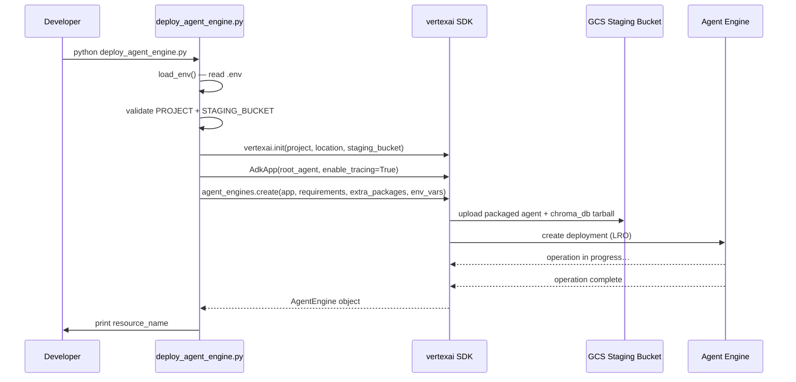

# DES: Deploy us_olympics_agent to Vertex AI Agent Engine

## Overview

Add `deploy_agent_engine.py` to deploy the existing `us_olympics_agent` ADK agent to Vertex AI Agent Engine alongside the current Cloud Run path. The ChromaDB index (`chroma_db/`) is bundled via `extra_packages`. A one-line change to `rag.py` makes the ChromaDB path configurable so it can be overridden at Agent Engine runtime.

---

## Files Changed

| File | Change |
|------|--------|
| `deploy_agent_engine.py` | **New** — deployment script |
| `us_olympics_agent/rag.py` | **Modified** — `_CHROMA_PATH` reads `CHROMA_DB_PATH` env var as override |
| `us_olympics_agent/.env` | **Updated by developer** — add `STAGING_BUCKET=gs://…` |

`deploy.py`, `Dockerfile`, and all other existing files are untouched.

---

## Architecture

```
Developer machine                     Google Cloud
─────────────────                     ─────────────
deploy_agent_engine.py
  │
  ├─ reads: us_olympics_agent/.env
  │    GOOGLE_CLOUD_PROJECT
  │    GOOGLE_CLOUD_LOCATION
  │    STAGING_BUCKET
  │
  ├─ vertexai.init(project, location, staging_bucket)
  │
  ├─ wraps root_agent with AdkApp
  │
  └─ agent_engines.create(...)  ──────►  GCS staging bucket (package upload)
                                               │
                                         Agent Engine runtime
                                               │
                                    ┌──────────┴──────────┐
                                    │  us_olympics_agent/  │
                                    │  (installed module)  │
                                    │                      │
                                    │  /app/chroma_db/     │
                                    │  (extra_packages)    │
                                    └──────────────────────┘
```

---

## Component Design

### 1. `rag.py` — path change (minimal)

Replace the hardcoded `_CHROMA_PATH` with an env-var-aware version:

```python
# Before
_CHROMA_PATH = Path(__file__).parent / "chroma_db"

# After
_CHROMA_PATH = Path(os.environ.get("CHROMA_DB_PATH", str(Path(__file__).parent / "chroma_db")))
```

- Local development: env var not set → falls back to `Path(__file__).parent / "chroma_db"` (no behaviour change).
- Agent Engine runtime: `CHROMA_DB_PATH=/app/chroma_db` is passed via env vars at create-time.

`os` is already imported (used in `_embed`), so no new imports are needed.

### 2. `us_olympics_agent/.env` — new key

The developer adds one line before first deployment:

```
STAGING_BUCKET=gs://your-existing-gcs-bucket
```

The script exits with a clear message if this key is missing.

### 3. `deploy_agent_engine.py` — new script

```
deploy_agent_engine.py
│
├── load_env()          # same pattern as deploy.py — reads us_olympics_agent/.env
├── validate()          # exits with message if PROJECT or STAGING_BUCKET missing
├── vertexai.init()     # project, location, staging_bucket
├── AdkApp(root_agent)  # wraps agent for Agent Engine
└── agent_engines.create(
        agent_engine = app,
        requirements = REQUIREMENTS,
        extra_packages = ["us_olympics_agent/chroma_db"],
        display_name = "us-olympics-agent",
        env_vars = {"CHROMA_DB_PATH": "/app/chroma_db",
                    "GOOGLE_CLOUD_PROJECT": project,
                    "GOOGLE_CLOUD_LOCATION": location,
                    "GOOGLE_GENAI_USE_VERTEXAI": "1"},
    )
    # blocks until deployment is live
    # prints remote.resource_name on success
```

#### Constants

```python
DISPLAY_NAME = "us-olympics-agent"
CHROMA_RUNTIME_PATH = "/app/chroma_db"   # Agent Engine working dir
REQUIREMENTS = [
    "google-cloud-aiplatform[adk,agent_engines]",
    "chromadb>=0.6.0",
]
```

#### Deployment API shape

Uses `vertexai.agent_engines.create()` (from `google-cloud-aiplatform[adk,agent_engines]` already in `pyproject.toml`). The `AdkApp` wrapper comes from `vertexai.preview.reasoning_engines`.

`agent_engines.create()` is synchronous from the caller's perspective: it blocks until the long-running operation completes and returns the deployed `AgentEngine` object. `remote.resource_name` contains the full resource path.

#### env_vars note

If the installed `google-cloud-aiplatform` version does not support `env_vars` as a keyword argument to `agent_engines.create()`, the fallback is to verify the actual Agent Engine working directory on first deployment (inspect logs or test with a print statement), update `CHROMA_RUNTIME_PATH` if needed, and rely solely on the `CHROMA_DB_PATH` env var approach once the correct path is confirmed.

---

## Sequence Diagram



---

## Testing

Manual smoke test after deployment:

```python
from vertexai import agent_engines
remote = agent_engines.get("projects/.../reasoningEngines/12345")
response = remote.query(input="Who won gold in 100m at Tokyo Olympics?")
print(response)
```

A response that cites athlete data (not just "NO_RESULTS_FOUND") confirms ChromaDB is accessible at runtime.

---

## Known Uncertainty

The exact path where Agent Engine extracts `extra_packages` directories is undocumented. This design assumes `/app/chroma_db` based on standard GCP container conventions. If first deployment fails with a ChromaDB "not found" error, the fix is to:

1. Check Agent Engine runtime logs for the working directory.
2. Update `CHROMA_RUNTIME_PATH` in the script and redeploy.

No code restructuring is needed — only the constant changes.
