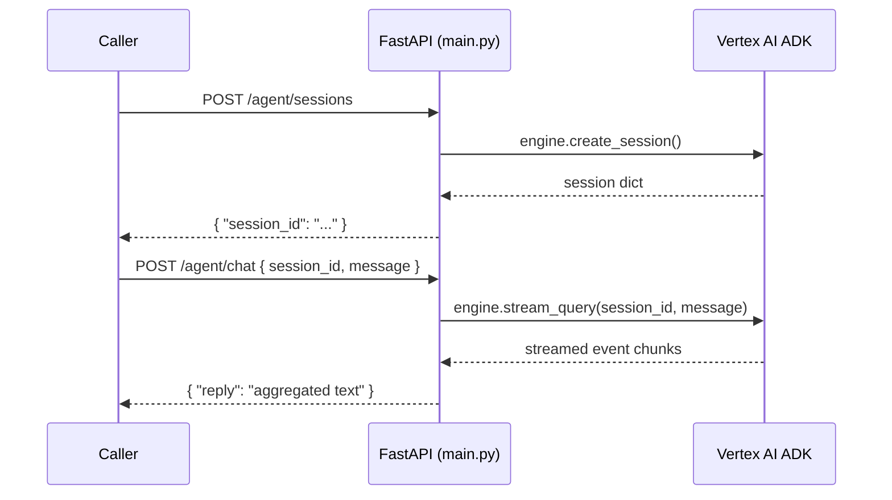

# DES: Vertex AI ADK Agent Endpoints

**Requirements:** `docs/ddd_requirement/REQ_agent_endpoints.md`

---

## Overview

Two endpoints are added to the existing `main.py` FastAPI app. They proxy to a Vertex AI ADK Agent Engine using the `vertexai` Python SDK (part of `google-cloud-aiplatform`). Configuration is read from environment variables at startup; missing vars cause a fast-fail before the server accepts any traffic.

---

## Architecture



---

## Dependencies

Add to `pyproject.toml`:

```
google-cloud-aiplatform[agent_engines,adk]>=1.93.0
```

This pulls in the `vertexai` namespace and the `agent_engines` submodule.

---

## Configuration

Read at module load time (before `app = FastAPI()`). Any missing variable raises `SystemExit` with a descriptive message:

```python
import os, sys

PROJECT_ID      = os.environ.get("PROJECT_ID")
LOCATION        = os.environ.get("LOCATION")
AGENT_ENGINE_ID = os.environ.get("AGENT_ENGINE_ID")

_missing = [k for k, v in {
    "PROJECT_ID": PROJECT_ID,
    "LOCATION": LOCATION,
    "AGENT_ENGINE_ID": AGENT_ENGINE_ID,
}.items() if not v]

if _missing:
    sys.exit(f"Missing required env vars: {', '.join(_missing)}")
```

---

## Vertex AI Client Initialisation

Initialised once at module level (after config validation):

```python
import vertexai
from vertexai.preview import agent_engines

vertexai.init(project=PROJECT_ID, location=LOCATION)

_RESOURCE_NAME = (
    f"projects/{PROJECT_ID}/locations/{LOCATION}"
    f"/reasoningEngines/{AGENT_ENGINE_ID}"
)
_engine = agent_engines.get(_RESOURCE_NAME)
```

`vertexai.init` picks up Application Default Credentials automatically — no explicit credential handling needed.

---

## Data Models (Pydantic)

```python
from pydantic import BaseModel

class ChatRequest(BaseModel):
    session_id: str
    message: str

class SessionResponse(BaseModel):
    session_id: str

class ChatResponse(BaseModel):
    reply: str
```

---

## Endpoint Implementations

### POST /agent/sessions

```python
from fastapi import HTTPException
from fastapi.responses import JSONResponse

@app.post("/agent/sessions", status_code=201)
def create_session() -> SessionResponse:
    try:
        session = _engine.create_session(user_id="")
        return SessionResponse(session_id=session["id"])
    except Exception as exc:
        raise HTTPException(status_code=502, detail=str(exc))
```

`session["id"]` is the short ID extracted from the full resource name returned by the SDK.

### POST /agent/chat

```python
@app.post("/agent/chat")
def chat(req: ChatRequest) -> ChatResponse:
    try:
        parts = []
        for event in _engine.stream_query(
            user_id="",
            session_id=req.session_id,
            message=req.message,
        ):
            # Each event is a dict; extract text content from ADK response parts
            for part in event.get("content", {}).get("parts", []):
                if text := part.get("text"):
                    parts.append(text)
        return ChatResponse(reply="".join(parts))
    except Exception as exc:
        raise HTTPException(status_code=502, detail=str(exc))
```

The `stream_query` generator is consumed synchronously. Since FastAPI's default thread pool handles sync route functions, this does not block the event loop.

> **Note:** The exact shape of each streamed event (the `content.parts[].text` path) must be verified against the live SDK response during implementation. Adjust extraction logic if the schema differs.

---

## Error Handling

| Scenario | Behaviour |
|---|---|
| Vertex AI SDK raises any exception | `HTTPException(502, detail=str(exc))` |
| Missing request field | FastAPI 422 (automatic Pydantic validation) |
| Missing env var at startup | `sys.exit(...)` before server starts |

---

## README Additions

Add an **Agent API** section after the existing API section:

````markdown
## Agent API

Requires the following environment variables:

| Variable | Description |
|---|---|
| `PROJECT_ID` | GCP project ID |
| `LOCATION` | Vertex AI region (e.g. `us-central1`) |
| `AGENT_ENGINE_ID` | ADK agent engine ID |

### `POST /agent/sessions`

Creates a new conversation session. Returns a `session_id` to use in subsequent chat requests.

```bash
SESSION_ID=$(curl -s -X POST http://localhost:8000/agent/sessions | jq -r .session_id)
echo "Session: $SESSION_ID"
```

### `POST /agent/chat`

Sends a message to the agent and returns the complete reply.

```bash
curl -s -X POST http://localhost:8000/agent/chat \
  -H "Content-Type: application/json" \
  -d "{\"session_id\": \"$SESSION_ID\", \"message\": \"Find me a soccer group in Seattle\"}"
```
````

---

## Testing Notes

Manually test with the local server (`uv run uvicorn main:app --reload`) after setting the three env vars and running `gcloud auth application-default login`. The curl examples in the README serve as the integration test script.
