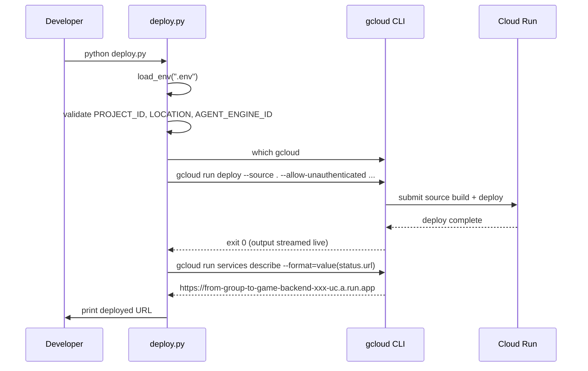

# DES: Cloud Run Deployment Script

## Scope

Two files change:
1. **New** `backend/deploy.py` — the deployment script (stdlib only, no pip install required).
2. **Edit** `backend/main.py` — widen CORS from `localhost:3000` to `*`.

---

## Architecture

```
Developer
    |
    v
python deploy.py
    |
    +-- load_env()          reads backend/.env
    +-- validate vars       exits on missing
    +-- check_gcloud()      exits if not on PATH
    |
    +-- subprocess.run()    gcloud run deploy --source .
    |       streams stdout/stderr live to terminal
    |
    +-- subprocess.run()    gcloud run services describe  (get URL)
    |
    v
prints "Deployed: https://from-group-to-game-backend-xxx-uc.a.run.app"
```



---

## `deploy.py` — Module Design

### Constants

```python
REQUIRED_VARS = ["PROJECT_ID", "LOCATION", "AGENT_ENGINE_ID"]
SERVICE_NAME  = "from-group-to-game-backend"
REGION        = "us-central1"
SCRIPT_DIR    = Path(__file__).parent   # always points to backend/
```

`SCRIPT_DIR` anchors `.env` lookup and `--source` to the script's own directory, so `python deploy.py` works from any working directory.

### Functions

#### `load_env(env_path: Path) -> dict[str, str]`

Stdlib-only `.env` parser:
- Exits with a clear message if the file does not exist.
- Skips blank lines and lines starting with `#`.
- Splits each line on the **first** `=` only (`str.partition('=')`), handling values that contain `=`.
- Returns a `{key: value}` dict (values are raw strings, no quote-stripping needed for this use case).

#### `check_gcloud() -> None`

Uses `shutil.which("gcloud")`. Exits with:
```
Error: gcloud CLI not found — install the Google Cloud SDK and authenticate with `gcloud auth login`.
```

#### `deploy(env_vars: dict[str, str]) -> None`

Builds the command list and runs it with `subprocess.run`, inheriting stdin/stdout/stderr from the parent process so output streams live:

```python
cmd = [
    "gcloud", "run", "deploy", SERVICE_NAME,
    "--source", str(SCRIPT_DIR),
    "--region", REGION,
    "--allow-unauthenticated",
    "--set-env-vars", ",".join(f"{k}={v}" for k, v in env_vars.items()),
]
result = subprocess.run(cmd)
if result.returncode != 0:
    sys.exit(result.returncode)
```

No `capture_output=True` here — output flows directly to the terminal in real time.

#### `get_service_url() -> str`

Runs a second, non-streaming subprocess call with `capture_output=True` to get the canonical URL:

```python
result = subprocess.run(
    ["gcloud", "run", "services", "describe", SERVICE_NAME,
     "--region", REGION, "--format=value(status.url)"],
    capture_output=True,
    text=True,
)
return result.stdout.strip()
```

**Rationale for second call:** Parsing the URL from streamed `gcloud run deploy` output is fragile — the format can change across gcloud SDK versions. A dedicated `describe` call with an explicit format string is stable and always returns the canonical URL.

#### `main() -> None`

Orchestrates the four steps: load env → validate → check gcloud → deploy → get URL → print.

---

## `main.py` — CORS Change

Single-line edit in `main.py`:

```python
# Before
allow_origins=["http://localhost:3000"],

# After
allow_origins=["*"],
```

No other changes to `main.py`.

---

## Error Handling Summary

| Failure | Where caught | Exit message |
|---|---|---|
| `.env` not found | `load_env()` | `Error: .env not found at <path>` |
| Missing env var | `main()` | `Error: Missing required env vars in .env: VAR1, VAR2` |
| `gcloud` not on PATH | `check_gcloud()` | `Error: gcloud CLI not found — install the Google Cloud SDK and authenticate with \`gcloud auth login\`.` |
| `gcloud run deploy` fails | `deploy()` | gcloud output already streamed; script exits with gcloud's exit code |

---

## Files Changed

| File | Change |
|---|---|
| `backend/deploy.py` | New file (~60 lines, stdlib only) |
| `backend/main.py` | 1-line CORS edit |
