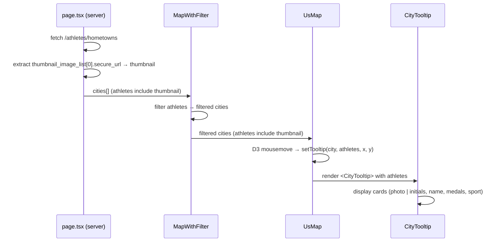

# DES: Map City Popup Redesign

**Requirement:** `docs/ddd_requirement/REQ_map_popup_redesign.md`

---

## Overview

Replace the plain-text city tooltip in `UsMap.tsx` with a richer popup component (`CityTooltip.tsx`) showing athlete cards. Three files change: `app/page.tsx` (add `thumbnail` to data), `MapWithFilter.tsx` (update type), `UsMap.tsx` (update type + swap tooltip). One new file is created: `components/CityTooltip.tsx`.

---

## Data Flow



---

## Updated Athlete Type

The shared athlete shape gains one field: `thumbnail: string` (empty string when absent).

```ts
// Used in page.tsx, MapWithFilter.tsx, UsMap.tsx
interface AthleteData {
  first_name: string
  last_name: string
  olympic_paralympic: string
  seasons: string[]
  medals: { gold: number; silver: number; bronze: number }
  sports: string[]
  thumbnail: string       // ← new; thumbnail_image_list[0]?.secure_url ?? ''
}
```

The `City` interface in both `MapWithFilter.tsx` and `UsMap.tsx` adopts this shape.

---

## File Changes

### `app/page.tsx`

In the `athletes.forEach` push call, add `thumbnail`:

```ts
thumbnail: (a.thumbnail_image_list?.[0]?.secure_url) ?? '',
```

### `MapWithFilter.tsx`

Add `thumbnail: string` to the `City.athletes` inline type. No other logic changes.

### `UsMap.tsx`

1. Update `City` interface to include `thumbnail: string` in the athletes array.
2. Update `tooltip` state type to carry `athletes: AthleteData[]` (same shape — already carries medals/sports via the existing type, just needs thumbnail added).
3. Remove the inline tooltip JSX from the `return`.
4. Import and render `<CityTooltip>` in its place.

```tsx
// in UsMap return:
{tooltip && (
  <CityTooltip
    x={tooltip.x}
    y={tooltip.y}
    city={tooltip.city}
    athletes={tooltip.athletes}
  />
)}
```

---

## New Component: `components/CityTooltip.tsx`

### Props

```ts
interface CityTooltipProps {
  x: number          // cursor clientX
  y: number          // cursor clientY
  city: string
  athletes: AthleteData[]
}
```

### Positioning

- Default offset: `left: x + 16, top: y - 20`.
- Clamp to viewport: if `x + 16 + POPUP_WIDTH > window.innerWidth`, flip to `left: x - POPUP_WIDTH - 8`.
- If `y - 20 + POPUP_HEIGHT > window.innerHeight`, adjust `top` upward.
- Fixed popup width: **260 px**; max-height: **300 px** on the athlete list.

### Layout

```
+--------------------------------------------+
| City Name                                  |  ← bold header, slate-100
+--------------------------------------------+
| [avatar] First Last                        |  ← name row
|          (G) 2  (S) 1  (B) 0              |  ← medals row
|          Sport Title                       |  ← sport, slate-400
+--------------------------------------------+
| [avatar] ...                               |
| ...                                        |  ← scrollable if > 300px
+--------------------------------------------+
```

### Avatar

- If `thumbnail` is non-empty: `` element, `40×40 px`, `object-cover`, `rounded-full`.
- If `thumbnail` is empty: slate-700 circle (`40×40 px`) with the athlete's initials (`first_name[0] + last_name[0]`, uppercase, `text-sm font-semibold text-slate-300`).
- `alt` attribute set to `"{first_name} {last_name}"` in both cases.

### Medal Row

Three inline items, always rendered (count 0 is shown):

| Medal  | Circle color       | Label |
|--------|--------------------|-------|
| Gold   | `#facc15` (yellow-400) | G |
| Silver | `#cbd5e1` (slate-300)  | S |
| Bronze | `#b45309` (amber-700)  | B |

Each item: `12×12 px` colored circle + count number, `text-xs`, gap `2px` between circle and count, `16px` gap between medal items.

### Sport

`sports[0]` if present, otherwise omitted. Rendered as `text-xs text-slate-400`.

### Styling

Matches the existing dark theme:
- Background: `bg-slate-800`
- Border: `border border-slate-600`
- Rounded: `rounded-lg`
- Shadow: `shadow-xl`
- `pointer-events-none` (tooltip never captures mouse)
- `fixed z-50`

---

## Edge Cases

| Case | Handling |
|------|----------|
| `thumbnail` empty / missing | Initials circle rendered |
| `sports` empty | Sport line not rendered |
| 0 medals | All three counters show `0` |
| Many athletes | Athlete list div gets `overflow-y-auto max-h-[300px]` |
| Single athlete | Renders one card, no scroll |

---

## Testing

Build check (`npm run build`) is sufficient to verify type safety across the data pipeline. Visual verification: hover a city dot on the running app and confirm the card layout matches the design.
