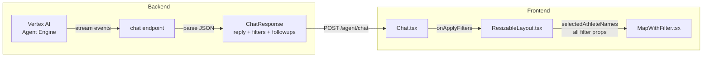
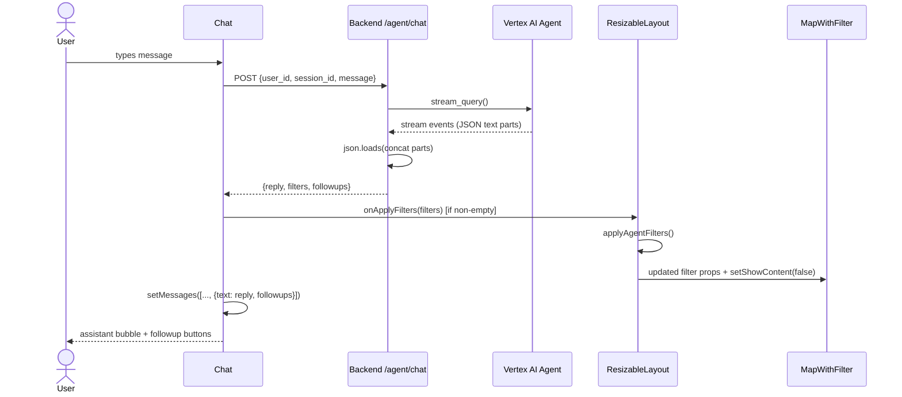

# DES: Structured Agent Response — Backend & Frontend Integration

**Requirement:** `docs/ddd_requirement/REQ_structured_agent_response.md`

---

## Overview

Five files change. The backend extends its `ChatResponse` model and parses the agent's JSON. The frontend wires the three new fields — `reply`, `filters`, `followups` — through `Chat` → `ResizableLayout` → `MapWithFilter`.



---

## Backend — `backend/main.py`

### Model changes

```python
class ChatResponse(BaseModel):
    reply: str
    filters: dict[str, list[str]] = {}
    followups: list[str] = []
```

### Parsing strategy

The agent with `output_schema=AgentResponse` emits a JSON string in the final streamed text parts. The endpoint collects all text parts (unchanged), then tries to parse the concatenated string as the agent's schema.

```python
@app.post("/agent/chat")
def chat(req: ChatRequest) -> ChatResponse:
    try:
        parts = []
        for event in _engine.stream_query(...):
            for part in event.get("content", {}).get("parts", []):
                if text := part.get("text"):
                    parts.append(text)

        raw = "".join(parts)
        try:
            parsed = json.loads(raw)
            return ChatResponse(
                reply=parsed["text"],
                filters=parsed.get("filters", {}),
                followups=parsed.get("followups", []),
            )
        except (json.JSONDecodeError, KeyError):
            return ChatResponse(reply=raw)   # graceful degradation

    except Exception as exc:
        raise HTTPException(status_code=502, detail=str(exc))
```

No new dependencies. The `json` module is already imported.

---

## Frontend

### 1. `Message` type — `components/Chat.tsx`

Add an ephemeral `followups` field. It is stored in React state but stripped before the localStorage write.

```typescript
interface Message {
  role: 'user' | 'assistant' | 'system'
  text: string
  typing?: boolean
  followups?: string[]   // ephemeral — not persisted
}
```

The existing persistence effect already filters typing indicators; extend it to strip `followups`:

```typescript
localStorage.setItem(
  LS_MESSAGES,
  JSON.stringify(
    messages
      .filter(m => !m.typing)
      .map(({ followups: _f, ...rest }) => rest)   // drop followups
  )
)
```

### 2. `Chat.tsx` — prop and send flow

**Prop signature change:**

```typescript
export default function Chat({
  onApplyPreset,
  onApplyFilters,
}: {
  onApplyPreset?: () => void
  onApplyFilters?: (filters: Record<string, string[]>) => void
})
```

**Response type inside `sendText`:**

```typescript
const data: {
  reply: string
  filters?: Record<string, string[]>
  followups?: string[]
} = await res.json()
```

**After successful response:**

```typescript
// 1. Apply filters if non-empty
if (data.filters && Object.keys(data.filters).length > 0) {
  onApplyFilters?.(data.filters)
}

// 2. Set message with followups
setMessages(prev => [
  ...prev.filter(m => !m.typing),
  { role: 'assistant', text: data.reply, followups: data.followups ?? [] },
])
```

**Rendering followup buttons** (replaces the hardcoded `FOLLOWUP_QUESTIONS` block):

```tsx
{!msg.typing && msg.followups && msg.followups.length > 0 && (
  <div className="flex flex-col gap-2 w-full max-w-[75%]">
    {msg.followups.map(q => (
      <button
        key={q}
        onClick={() => !isLoading && sendText(q)}
        disabled={isLoading}
        className="text-left text-sm text-[#94A3B8] px-3 py-1.5 rounded-lg
                   bg-[#1e293b] border-l-2 border-[#0B9FEA]
                   hover:text-[#e2e8f0] hover:bg-[#253347]
                   transition-colors disabled:opacity-50 disabled:cursor-not-allowed"
      >
        {q}
      </button>
    ))}
  </div>
)}
```

Remove the `FOLLOWUP_QUESTIONS` constant and the `onApplyPreset`-gated followup block. Keep the "Press to play" button as-is (still gated by `onApplyPreset`).

### 3. `ResizableLayout.tsx`

**New state:**

```typescript
const [selectedAthleteNames, setSelectedAthleteNames] = useState(new Set<string>())
```

**New function `applyAgentFilters`:**

```typescript
function applyAgentFilters(filters: Record<string, string[]>) {
  // 'game' maps 1-to-1 with component values ("Olympian", "Paralympian")
  if ('game' in filters)   setGameFilter(new Set(filters.game))
  if ('season' in filters) setSeasonFilter(new Set(filters.season))

  // Medal: agent uses Title Case + "No Medal"; component uses lowercase + "noMedal"
  if ('medal' in filters)  setMedalFilter(new Set(filters.medal.map(mapMedalValue)))

  // State: agent list has at most one element
  if ('state' in filters)  setSelectedState(filters.state[0] ?? '')

  if ('sport' in filters)  setSportFilter(new Set(filters.sport))

  // Athlete: name-based; clear numeric ID selection
  if ('athlete' in filters) {
    setSelectedAthleteNames(new Set(filters.athlete))
    setSelectedAthleteIds(new Set<number>())
  }

  // City: look up "CityName|STATE" keys from the cities prop
  if ('city' in filters) {
    const keys = buildCityKeys(filters.city, cities)
    setSelectedCityKeys(keys)
  }

  // Auto-switch to map view
  setShowContent(false)
  setSearchClearSignal(prev => prev + 1)
}
```

**Helper functions** (module-level or inline in component file):

```typescript
// "Gold" → "gold", "No Medal" → "noMedal"
function mapMedalValue(v: string): string {
  if (v === 'No Medal') return 'noMedal'
  return v.toLowerCase()
}

// Build "City|STATE" set from agent city names + the fetched cities data
function buildCityKeys(cityNames: string[], cities: any[]): Set<string> {
  const lower = cityNames.map(n => n.toLowerCase())
  const keys = new Set<string>()
  for (const c of cities) {
    if (lower.includes((c.city ?? '').toLowerCase())) {
      keys.add(`${c.city}|${c.state}`)
    }
  }
  return keys
}
```

**Pass new props to `MapContentSlider` and then to `MapWithFilter`:**

```typescript
<MapContentSlider
  ...existing props...
  selectedAthleteNames={selectedAthleteNames}
  onAthleteNamesChange={setSelectedAthleteNames}
/>
```

**Pass `applyAgentFilters` to `Chat`:**

```typescript
<Chat onApplyPreset={applyPreset} onApplyFilters={applyAgentFilters} />
```

**Update `handleClearAllFilters` to also clear athlete names:**

```typescript
function handleClearAllFilters() {
  ...existing...
  setSelectedAthleteNames(new Set<string>())
}
```

### 4. `MapContentSlider.tsx`

Thread the two new props (`selectedAthleteNames`, `onAthleteNamesChange`) through to `MapWithFilter`. No logic change.

### 5. `MapWithFilter.tsx`

**New prop:**

```typescript
selectedAthleteNames?: Set<string>
```

**Filtering logic** — where athletes are currently filtered by `selectedAthleteIds`, add name-based OR:

```typescript
// Existing:  show athlete if its ID is in selectedAthleteIds
// New:       also show if its fullName is in selectedAthleteNames

const matchesAthleteFilter =
  selectedAthleteIds.size === 0 && (!selectedAthleteNames || selectedAthleteNames.size === 0)
  || selectedAthleteIds.has(athlete.id)
  || selectedAthleteNames?.has(athlete.fullName)
```

The exact insertion point depends on where `selectedAthleteIds` is currently checked — the pattern above replaces the existing `selectedAthleteIds.size === 0` early-return with a combined check.

---

## Data Flow Sequence



---

## Medal Value Mapping

| Agent value | Component value |
|---|---|
| `"Gold"` | `"gold"` |
| `"Silver"` | `"silver"` |
| `"Bronze"` | `"bronze"` |
| `"No Medal"` | `"noMedal"` |

---

## Files Changed

| File | Change |
|---|---|
| `backend/main.py` | Extend `ChatResponse`; add JSON parse in `chat()` |
| `frontend/components/Chat.tsx` | New `onApplyFilters` prop; extend `Message`; per-message followups |
| `frontend/components/ResizableLayout.tsx` | New `selectedAthleteNames` state; `applyAgentFilters`; pass to `MapContentSlider` |
| `frontend/components/MapContentSlider.tsx` | Thread `selectedAthleteNames` / `onAthleteNamesChange` props |
| `frontend/components/MapWithFilter.tsx` | Accept `selectedAthleteNames`; apply to filter logic |

---

## Notes

- The `FOLLOWUP_QUESTIONS` hardcoded constant is deleted. The "Press to play" button and its `onApplyPreset` gating are unchanged.
- `searchClearSignal` is incremented in `applyAgentFilters` to reset any active `AthleteSearch` UI when the agent applies a new filter set.
- The `json.loads` parse inside `chat()` runs on the concatenated string of all streamed text parts. If the agent emits the JSON across multiple stream events (token by token), concatenation assembles it correctly before parsing.
