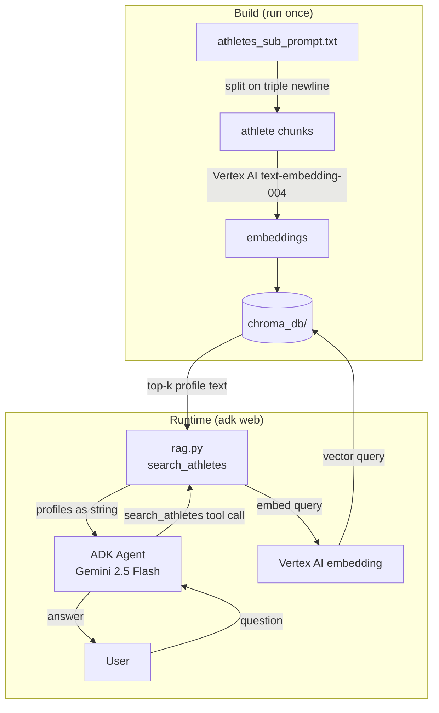
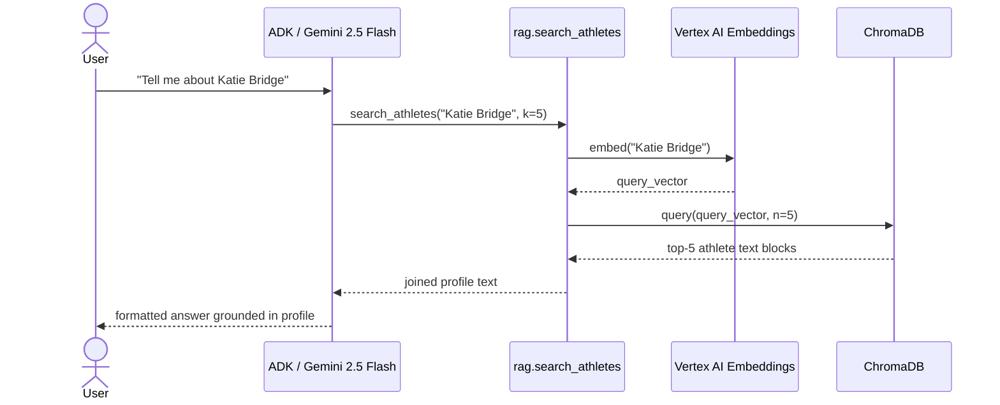

# DES: US Olympics Agent

**Status:** Draft  
**Date:** 2026-05-09  
**Requirements:** `docs/ddd_requirement/REQ_us_olympics_agent.md`

---

## Overview

Extend the existing Google ADK agent (`us_olympics_agent/agent.py`) with a RAG pipeline backed by ChromaDB and Vertex AI embeddings. A one-time build script chunks `athletes_sub_prompt.txt` by athlete profile, embeds each chunk via Vertex AI `text-embedding-004`, and persists the index to disk. At runtime the agent is given a `search_athletes` tool that queries the index and returns relevant profile text to ground its answers.

---

## Architecture



---

## File Structure

```
agent/
  us_olympics_agent/
    __init__.py
    agent.py            # ADK Agent definition + tool wiring
    rag.py              # ChromaDB client, embed fn, search_athletes tool
    build_index.py      # One-time index build script
    athletes_sub_prompt.txt
    chroma_db/          # Persisted vector index (gitignored)
    .env
```

---

## Component Design

### `build_index.py`

Standalone script; run once before first use (or whenever `athletes_sub_prompt.txt` changes).

**Responsibilities:**
1. Read `athletes_sub_prompt.txt` and split on `\n\n\n` to get one block per athlete.
2. Strip empty blocks.
3. For each block, call Vertex AI `text-embedding-004` to get a dense vector.
4. Upsert all (id, embedding, document) tuples into a ChromaDB persistent collection named `athletes`.
5. Print a completion summary (number of athletes indexed).

**Invocation:**
```
uv run python us_olympics_agent/build_index.py
```

ChromaDB path resolved relative to `build_index.py`'s location: `Path(__file__).parent / "chroma_db"`.

---

### `rag.py`

Loaded at agent startup. Exposes the `search_athletes` callable that the ADK agent uses as a tool.

**Module-level init:**
- Instantiate a `chromadb.PersistentClient` pointing at `us_olympics_agent/chroma_db/`.
- Get (or raise a clear error for) the `athletes` collection.
- No embedding happens at module load time.

**`search_athletes(query: str, k: int = 5) -> str`**

```
1. Embed `query` using Vertex AI text-embedding-004.
2. Call collection.query(query_embeddings=[vector], n_results=k).
3. Join the returned document strings with "\n\n---\n\n".
4. Return the joined string to the agent.
   If the collection returns 0 results, return a sentinel string:
   "NO_RESULTS_FOUND" so the agent can detect and handle it.
```

Return type is `str` — the agent receives raw profile text and synthesises its answer.

**Error handling in `rag.py`:**
- If `chroma_db/` directory is missing or collection does not exist: raise `RuntimeError` with a clear message ("Index not found. Run build_index.py first."). This surfaces at agent startup, not mid-query.
- If the Vertex AI embedding call fails: raise the exception; ADK will return an error turn to the user rather than crashing the process.

---

### `agent.py`

```python
from google.adk.agents.llm_agent import Agent
from us_olympics_agent.rag import search_athletes

INSTRUCTION = """
You are a knowledgeable assistant for US Olympic and Paralympic athletes.

When answering questions:
1. Always call the search_athletes tool first to find relevant athlete profiles.
2. Base your answers strictly on the returned profiles and your factual training knowledge.
3. Do not speculate, invent facts, or offer opinions about athletes.
4. If the tool returns NO_RESULTS_FOUND, clearly tell the user the dataset has no matching
   information, then answer from general training knowledge if you can — and say so explicitly.
5. If a name is ambiguous, list the candidates and ask the user to clarify.
6. If a query is off-topic (not about athletes or sports), politely redirect.
7. Always respond in English.
"""

root_agent = Agent(
    model='gemini-2.5-flash',
    name='us_olympics_agent',
    description='Expert assistant for US Olympic and Paralympic athlete information.',
    instruction=INSTRUCTION,
    tools=[search_athletes],
)
```

Multi-turn session context is handled by ADK's built-in session management — no extra state code required.

---

## Data Model

### ChromaDB Collection: `athletes`

| Field | Type | Content |
|---|---|---|
| `id` | `str` | Zero-padded integer index (`"0000"`, `"0001"`, …) |
| `document` | `str` | Full raw athlete text block from `athletes_sub_prompt.txt` |
| `embedding` | `list[float]` | Vertex AI `text-embedding-004` vector (768 dims) |

No metadata fields are stored — the raw document text is sufficient for the agent to extract sport, medals, hometown, etc. from the returned string.

---

## Embedding Model

| Property | Value |
|---|---|
| Model | `text-embedding-004` |
| Provider | Vertex AI (`GOOGLE_CLOUD_PROJECT`, `GOOGLE_CLOUD_LOCATION` from `.env`) |
| Vector dimensions | 768 |
| Task type used | `RETRIEVAL_DOCUMENT` (build) / `RETRIEVAL_QUERY` (search) |

Vertex AI auth uses the existing ADK environment variables already configured in `.env`.

---

## Sequence: Typical Query



---

## Dependencies

Add to `pyproject.toml`:

```toml
dependencies = [
    "google-adk>=1.32.0",
    "chromadb>=0.6.0",
    "google-cloud-aiplatform>=1.60.0",  # Vertex AI embeddings SDK
]
```

`google-cloud-aiplatform` provides `vertexai.language_models.TextEmbeddingModel` used in both `build_index.py` and `rag.py`.

---

## Error & Edge Case Handling

| Scenario | Handling |
|---|---|
| `chroma_db/` missing at startup | `rag.py` raises `RuntimeError` with build instructions; agent fails to start cleanly |
| Vertex AI embedding call fails (network / quota) | Exception propagates to ADK; ADK returns an error turn to user |
| `search_athletes` returns `NO_RESULTS_FOUND` | Agent instruction directs it to answer from training data and flag the source |
| Ambiguous name match | Agent instruction directs it to list candidates and ask for clarification |
| Off-topic query | Agent instruction directs it to decline and redirect |
| Empty / very short query | Gemini handles gracefully by asking for more detail |

---

## Testing

- **Unit:** `rag.py` functions (chunking, embedding call, query result formatting) can be tested in isolation by mocking the Vertex AI client and ChromaDB client.
- **Integration:** Run `build_index.py` against a small sample of the file, then call `search_athletes` and assert the correct athlete block is returned.
- **Manual:** `adk web` — exercise each of the four query types (name lookup, medals, sport filter, bio detail) and one multi-turn exchange.

---

## Gitignore Addition

```
agent/us_olympics_agent/chroma_db/
```
