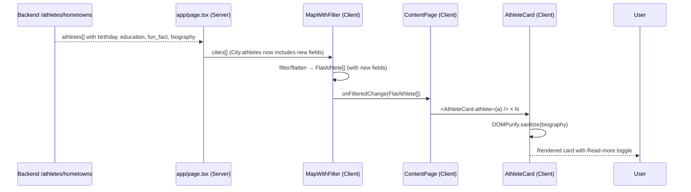

# DES: Athlete Card Redesign

**Status:** Locked  
**Created:** 2026-05-09  
**Requirements:** `docs/ddd_requirement/REQ_athlete_card_redesign.md`

---

## 1. Overview

Five files change in total — one backend, four frontend. The backend adds four fields to an existing endpoint. The frontend extends one type, updates two data-mapping sites, fully rewrites the card component, and adjusts the grid in the content page.

```
backend/main.py          ← add birthday, education, fun_fact, biography to response
app/page.tsx             ← map new API fields into City.athletes
components/
  MapWithFilter.tsx      ← extend City.athletes type + FlatAthlete type + onFilteredChange mapping
  AthleteCard.tsx        ← full redesign (new layout, DOMPurify sanitization, Read-more toggle)
  ContentPage.tsx        ← grid-cols-2 (fixed)
```

---

## 2. Dependencies

One new npm package:

```
npm install dompurify @types/dompurify
```

**Rationale:** `AthleteCard` is a `'use client'` component — DOMPurify runs in the browser where it has native DOM access and no extra polyfills needed. `isomorphic-dompurify` (with its jsdom peer) is unnecessary here and heavier.

---

## 3. Backend Change — `backend/main.py`

In `get_hometowns`, extend the dict pushed to `result`:

```python
result.append({
    # existing fields …
    "first_name":          a.get("first_name"),
    "last_name":           a.get("last_name"),
    "hometown":            hometown,
    "olympic_paralympic":  a.get("olympic_paralympic"),
    "seasons":             list({s.get("season") for s in a.get("sport", []) if s.get("season")}),
    "medals":              a.get("medals", {"gold": 0, "silver": 0, "bronze": 0}),
    "sports":              list({s.get("title") for s in a.get("sport", []) if s.get("title")}),
    "thumbnail_image_list": a.get("thumbnail_image_list", [])[:1],
    # new fields
    "birthday":   a.get("bio", {}).get("birthday"),    # str | None, ISO timestamp
    "education":  a.get("bio", {}).get("education"),   # str | None
    "fun_fact":   a.get("bio", {}).get("fun_fact"),    # str | None
    "biography":  a.get("bio", {}).get("biography"),   # str | None, raw HTML
})
```

All four are optional at the Python level (`None` when the key is absent or null).

---

## 4. Data Model — `FlatAthlete` (in `MapWithFilter.tsx`)

Extend the existing `FlatAthlete` export interface. `FlatAthlete` stays in `MapWithFilter.tsx` — no file moves.

```typescript
export interface FlatAthlete {
  // existing
  first_name: string
  last_name:  string
  city:       string
  sports:     string[]
  medals:     { gold: number; silver: number; bronze: number }
  thumbnail:  string
  // new
  state:      string          // always present (comes from hometown.state)
  birthday:   string | null   // ISO timestamp string, e.g. "1986-06-08T00:00:00"
  education:  string | null
  fun_fact:   string | null
  biography:  string | null   // raw HTML — sanitize before render
}
```

The `City.athletes` inline type in `MapWithFilter.tsx` also needs the four new fields (matching what `page.tsx` pushes into it):

```typescript
athletes: {
  first_name:        string
  last_name:         string
  olympic_paralympic: string
  seasons:           string[]
  medals:            { gold: number; silver: number; bronze: number }
  sports:            string[]
  thumbnail:         string
  // new
  birthday:          string | null
  education:         string | null
  fun_fact:          string | null
  biography:         string | null
}[]
```

---

## 5. Data Mapping

### 5.1 `app/page.tsx` — extend the athlete push

```typescript
cityMap.get(key)!.athletes.push({
  first_name:         a.first_name,
  last_name:          a.last_name,
  olympic_paralympic: a.olympic_paralympic ?? '',
  seasons:            a.seasons ?? [],
  medals:             a.medals ?? { gold: 0, silver: 0, bronze: 0 },
  sports:             a.sports ?? [],
  thumbnail:          a.thumbnail_image_list?.[0]?.secure_url ?? '',
  // new
  birthday:           a.birthday ?? null,
  education:          a.education ?? null,
  fun_fact:           a.fun_fact ?? null,
  biography:          a.biography ?? null,
})
```

### 5.2 `components/MapWithFilter.tsx` — `onFilteredChange` mapping

In the `useEffect` that calls `onFilteredChange`, extend the athlete mapping to pass through all new fields plus `state`:

```typescript
onFilteredChange(
  filtered.flatMap(c =>
    c.athletes.map(a => ({
      first_name: a.first_name,
      last_name:  a.last_name,
      city:       c.city,
      state:      c.state,          // new
      sports:     a.sports,
      medals:     a.medals,
      thumbnail:  a.thumbnail,
      birthday:   a.birthday,       // new
      education:  a.education,      // new
      fun_fact:   a.fun_fact,       // new
      biography:  a.biography,      // new
    }))
  )
)
```

---

## 6. `components/AthleteCard.tsx` — Full Redesign

### 6.1 Layout

```
+-----------------------------------------------+
|  [photo/  ]  Name (slate-100, bold)            |
|  [initials]  City, State (slate-300)            |
|              Birthday (slate-400, if present)   |
|              Education (slate-400, if present)  |
|              Sports (slate-400, if present)     |
+-----------------------------------------------+
|  🥇 3  🥈 2  (if any medals)                  |
|  Fun fact: "..." (if present)                  |
|  [biography first ~3 lines]                    |
|  [Read more ▼]  /  [Show less ▲]              |
+-----------------------------------------------+
```

### 6.2 Photo area

- Square photo on the left (fixed size, e.g. `w-24 h-24` or `w-28 h-28`), `object-cover`, rounded corners.
- On `onError` or absent `thumbnail`: render initials (`first_name[0] + last_name[0]`, uppercased) centered in the same square with `bg-[#0f172a]` and `text-slate-400`.
- Use Next.js `<Image>` component (as the existing card does).

### 6.3 Birthday formatting

Formatted client-side from the ISO timestamp string using the `Date` constructor and `toLocaleDateString`:

```typescript
function formatBirthday(iso: string): string {
  const d = new Date(iso)
  return d.toLocaleDateString('en-US', { month: 'long', day: 'numeric', year: 'numeric' })
  // e.g. "June 8, 1986"
}
```

Called only when `birthday` is non-null.

### 6.4 Biography HTML rendering

```typescript
import DOMPurify from 'dompurify'

// Inside component, before render:
const cleanBio = biography ? DOMPurify.sanitize(biography) : null
```

Rendered via:

```tsx
<div dangerouslySetInnerHTML={{ __html: cleanBio! }} />
```

### 6.5 Biography collapse

State: `const [bioExpanded, setBioExpanded] = useState(false)`

- **Collapsed:** `max-h-[4.5rem] overflow-hidden` (approx. 3 lines at 1.5rem line-height)
- **Expanded:** no `max-height` restriction
- Toggle button below the biography div: "Read more ▼" / "Show less ▲"
- No animation (instant toggle per decision).

---

## 7. `components/ContentPage.tsx` — Grid

Change the grid class from `grid-cols-2 md:grid-cols-3 lg:grid-cols-4` to `grid-cols-2` (fixed 2 columns at all breakpoints).

---

## 8. Data Flow Diagram



---

## 9. File Change Summary

| File | Change type | What changes |
|------|-------------|--------------|
| `backend/main.py` | Extend | Add 4 fields to result dict |
| `app/page.tsx` | Extend | Map 4 new API fields in athlete push |
| `components/MapWithFilter.tsx` | Extend | `City.athletes` type + `FlatAthlete` type + `onFilteredChange` mapping |
| `components/AthleteCard.tsx` | Rewrite | New layout, DOMPurify sanitization, Read-more toggle |
| `components/ContentPage.tsx` | Minor edit | `grid-cols-2` fixed |

---

## 10. Testing Notes

- Verify cards with all optional fields null render without empty rows.
- Verify photo fallback to initials on `onError`.
- Verify "Read more" expands biography and "Show less" collapses it independently per card.
- Verify biography HTML is sanitized (any injected `<script>` tags in test data are stripped).
