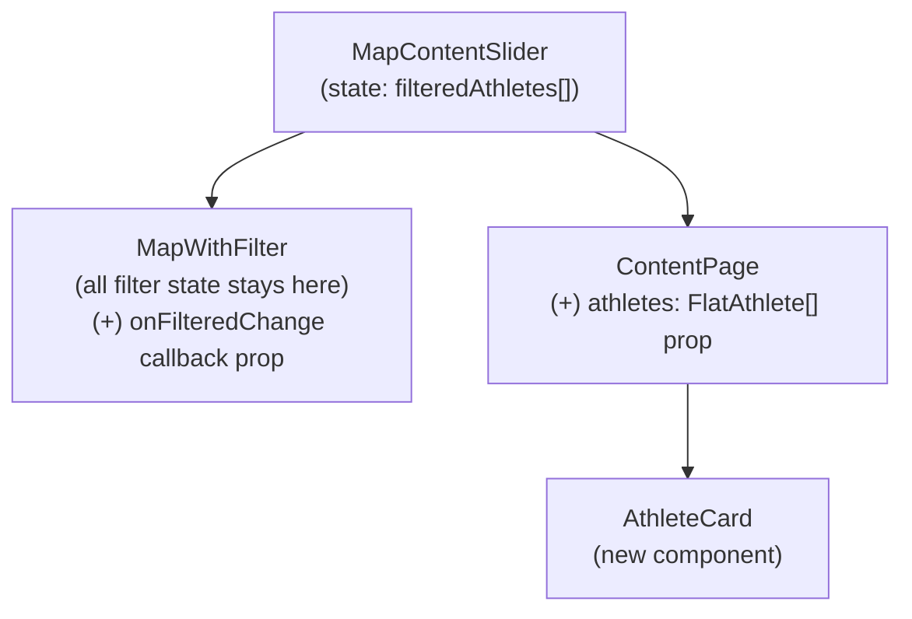
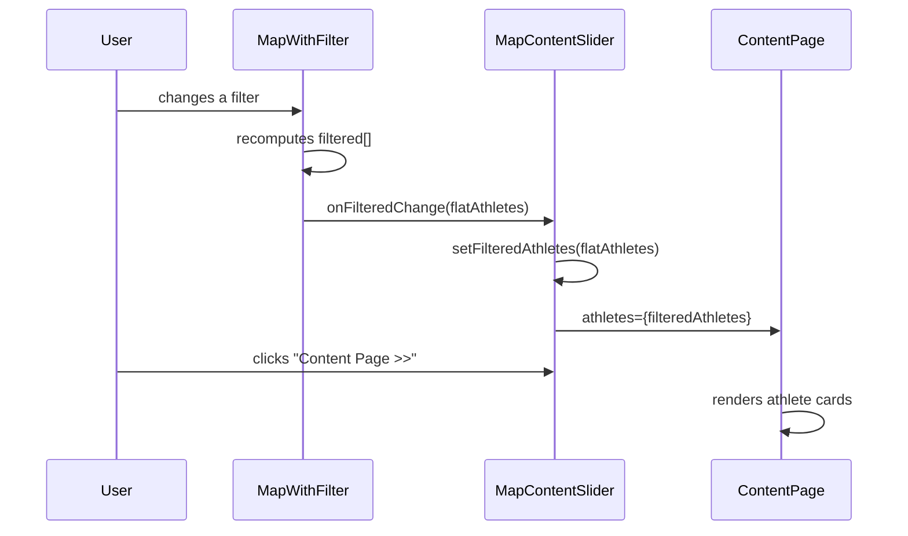

# DES: Athlete Cards on Content Page

## Scope

Add a responsive grid of athlete cards to `ContentPage` that mirrors the filtered athlete set visible on the map. All existing filters (game type, season, medals, sport disciplines, athlete search, city search, state selection) must be reflected in the cards in real time.

---

## Architecture

### Component Tree (after change)



### Data Flow



---

## Types

Define `FlatAthlete` inline in `MapContentSlider.tsx` (co-located with the state that holds it):

```ts
interface FlatAthlete {
  first_name: string
  last_name: string
  city: string
  sports: string[]
  medals: { gold: number; silver: number; bronze: number }
  thumbnail: string
}
```

Export it so `ContentPage` and `AthleteCard` can import it from `MapContentSlider`.

---

## Changes by File

### `components/MapWithFilter.tsx`

1. Add optional prop `onFilteredChange?: (athletes: FlatAthlete[]) => void` to the component signature.
2. Import `FlatAthlete` from `./MapContentSlider`.
3. After the `filtered` derivation, add a `useEffect`:

```ts
useEffect(() => {
  if (!onFilteredChange) return
  const flat: FlatAthlete[] = filtered.flatMap(c =>
    c.athletes.map(a => ({
      first_name: a.first_name,
      last_name: a.last_name,
      city: c.city,
      sports: a.sports,
      medals: a.medals,
      thumbnail: a.thumbnail,
    }))
  )
  onFilteredChange(flat)
}, [filtered])  // eslint-disable-line react-hooks/exhaustive-deps
```

> `onFilteredChange` is intentionally excluded from the dependency array: it is a stable callback reference passed from `MapContentSlider` and including it would cause infinite re-render loops if the parent doesn't memoize it.

### `components/MapContentSlider.tsx`

1. Export `FlatAthlete` interface.
2. Add `filteredAthletes` state: `const [filteredAthletes, setFilteredAthletes] = useState<FlatAthlete[]>([])`.
3. Pass `onFilteredChange={setFilteredAthletes}` to `<MapWithFilter>`.
4. Pass `athletes={filteredAthletes}` to `<ContentPage>`.

### `components/ContentPage.tsx`

1. Add `athletes: FlatAthlete[]` to props.
2. Import `FlatAthlete` from `./MapContentSlider`.
3. Import and render `<AthleteCard>` for each athlete in a scrollable responsive grid.
4. Show empty state message when `athletes.length === 0`.

Layout structure:

```tsx
<div className="w-full h-full bg-[#0f172a] rounded-lg border border-[#1A1A1A] p-4 flex flex-col gap-3">
  {/* Back button row */}
  <div className="flex items-center h-[52px]">
    <button onClick={onMapPage} ...><< Map Page</button>
  </div>

  {/* Card grid */}
  {athletes.length === 0 ? (
    <div className="flex-1 flex items-center justify-center">
      <p className="text-[#71717A] text-sm">No athletes match the current filters.</p>
    </div>
  ) : (
    <div className="flex-1 overflow-y-auto">
      <div className="grid grid-cols-2 md:grid-cols-3 lg:grid-cols-4 gap-4">
        {athletes.map((a, i) => <AthleteCard key={i} athlete={a} />)}
      </div>
    </div>
  )}
</div>
```

### `components/AthleteCard.tsx` (new file)

Props: `{ athlete: FlatAthlete }`

Card structure (dark theme, matches existing slate palette):

```
+---------------------------+
| [square image / initials] |
| First Last                |
| City                      |
| Sport1, Sport2            |
| 🥇 2  🥈 1                 |  ← only non-zero medals shown
+---------------------------+
```

**Image / fallback logic:**

- Render `<Image>` from `next/image` when `thumbnail` is non-empty.
- On `onError` or empty `thumbnail`, render a fallback `<div>` with the athlete's initials (first letter of `first_name` + first letter of `last_name`), styled as a square with `bg-[#1e293b]` and centered text.
- Both the image and fallback share the same fixed square dimensions for layout consistency.

**Medal display logic:**

```ts
const medals = [
  { key: 'gold',   icon: '🥇', count: athlete.medals.gold },
  { key: 'silver', icon: '🥈', count: athlete.medals.silver },
  { key: 'bronze', icon: '🥉', count: athlete.medals.bronze },
].filter(m => m.count > 0)
```

Render each medal icon and count inline; render nothing if `medals` is empty.

---

## Styling Conventions

Follow existing patterns in the codebase:

| Property | Value |
|---|---|
| Background | `bg-[#0f172a]` (page) / `bg-[#1e293b]` (card surface) |
| Border | `border border-[#334155]` |
| Primary text | `text-[#e2e8f0]` |
| Secondary text | `text-[#94a3b8]` |
| Font family | `'Geist', sans-serif` via inline style where needed |
| Corner radius | `rounded-xl` for cards |

---

## Rationale for Key Decisions

| Decision | Rationale |
|---|---|
| Callback prop over lifting state | Avoids a large refactor of MapWithFilter's 14 state values. Filter logic stays co-located with the filter UI. |
| `useEffect` for callback timing | Standard React pattern; avoids render-phase side effects. The one-render lag is imperceptible to users. |
| `FlatAthlete` inline in MapContentSlider | Only two components need this type right now. A shared types file would be premature. |
| CSS initials avatar | Zero extra assets; initials are more personal than a generic silhouette; consistent layout guaranteed. |
| 2→3→4 grid columns | Matches the available content area width (shares screen with chat sidebar) at typical laptop/desktop widths. |
