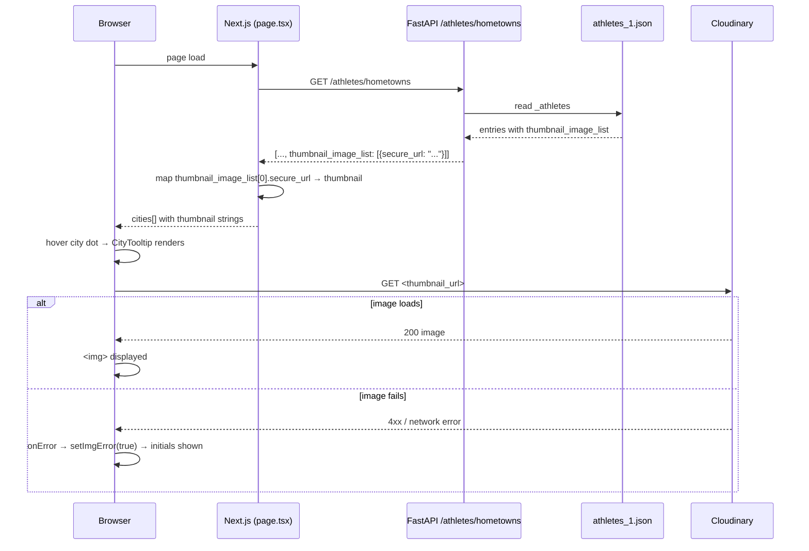

# DES: Show Athlete Photo in City Popup

**Requirement:** `docs/ddd_requirement/REQ_athlete_popup_photo.md`

---

## Overview

Two surgical edits fix the missing photo pipeline end-to-end:

1. **`backend/main.py`** — add `thumbnail_image_list` (first entry only) to the `/athletes/hometowns` response.
2. **`components/CityTooltip.tsx`** — add a `useState` error flag to `Avatar` so a broken image URL falls back to the initials circle.

`app/page.tsx` already maps `a.thumbnail_image_list?.[0]?.secure_url` to `thumbnail` — no change needed there.

---

## Data Flow



---

## Backend Change — `backend/main.py`

### `get_hometowns()` response dict

Add one key to the existing `result.append({...})` block:

```python
thumbnail_list = a.get("thumbnail_image_list", [])
result.append({
    "first_name": a.get("first_name"),
    "last_name": a.get("last_name"),
    "hometown": hometown,
    "olympic_paralympic": a.get("olympic_paralympic"),
    "seasons": list({s.get("season") for s in a.get("sport", []) if s.get("season")}),
    "medals": a.get("medals", {"gold": 0, "silver": 0, "bronze": 0}),
    "sports": list({s.get("title") for s in a.get("sport", []) if s.get("title")}),
    "thumbnail_image_list": thumbnail_list[:1],   # ← new
})
```

**Why first entry only (`[:1]`):** the frontend only ever reads index 0; returning the full list would send unused bytes on every request.

**Why preserve array shape:** `page.tsx` already uses `a.thumbnail_image_list?.[0]?.secure_url`, so keeping the list-of-objects structure avoids touching the frontend mapping.

---

## Frontend Change — `components/CityTooltip.tsx`

### `Avatar` component

Replace the current `Avatar` with a version that tracks image load failure via a `useState` boolean. When `thumbnail` is absent **or** the image errors, render the initials `<span>` instead.

```tsx
function Avatar({ thumbnail, firstName, lastName }: { thumbnail: string; firstName: string; lastName: string }) {
  const [imgError, setImgError] = useState(false)
  const initials = `${firstName[0] ?? ''}${lastName[0] ?? ''}`.toUpperCase()

  if (thumbnail && !imgError) {
    return (
      // eslint-disable-next-line @next/next/no-img-element
       setImgError(true)}
      />
    )
  }

  return (
    <span
      className="rounded-full flex-shrink-0 flex items-center justify-center bg-slate-700 text-slate-300 text-sm font-semibold"
      style={{ width: 40, height: 40 }}
      aria-label={`${firstName} ${lastName}`}
    >
      {initials}
    </span>
  )
}
```

**Why `useState` over `onError` src-clear trick:** React state produces a clean conditional render with no DOM hacks; the one extra re-render on error is imperceptible to the user.

**`useState` import:** `useState` is not yet imported in `CityTooltip.tsx` — add it to the React import line.

---

## File Change Summary

| File | Change |
|------|--------|
| `backend/main.py` | Add `"thumbnail_image_list": thumbnail_list[:1]` to `get_hometowns` response dict |
| `components/CityTooltip.tsx` | Import `useState`; add `imgError` state + `onError` handler to `Avatar` |
| `app/page.tsx` | No change |

---

## Testing Notes

- Verify athletes with a populated `thumbnail_image_list` show a photo in the popup.
- Verify athletes with an empty `thumbnail_image_list` show initials (not a blank or broken element).
- Temporarily point one athlete's thumbnail URL to an invalid address and confirm initials appear (no browser broken-image icon).
