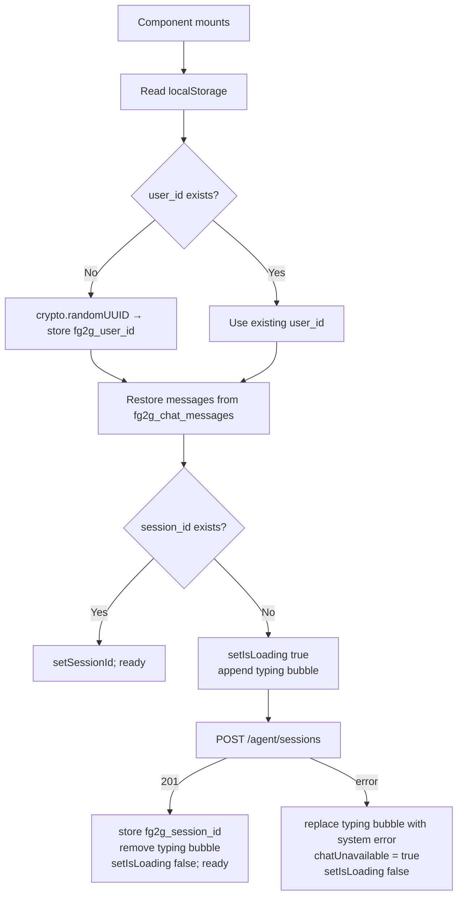
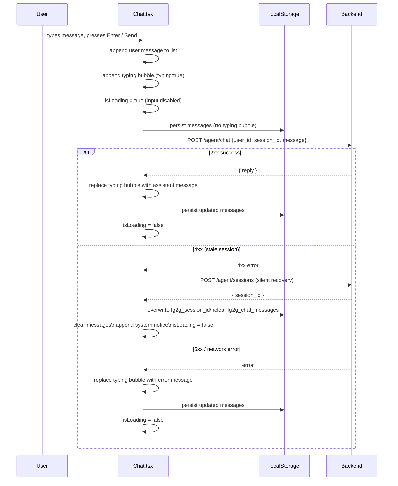
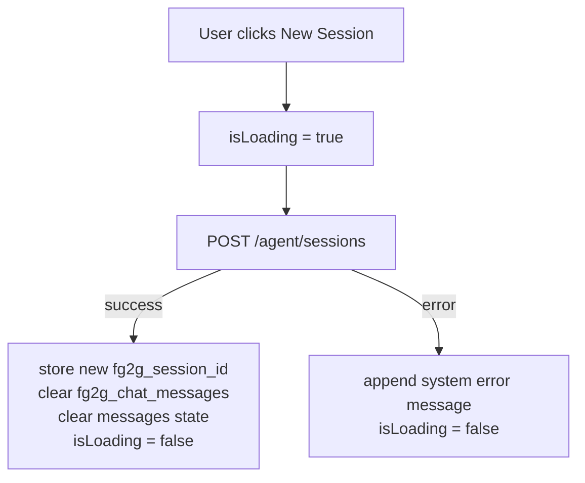

# DES: Chat Agent Integration

**Requirement:** `docs/ddd_requirement/REQ_chat_agent_integration.md`

---

## Summary

All changes are confined to `components/Chat.tsx` (extended in-place) and a
one-line addition to `.env.local`. No new files are created.

---

## Environment

`.env.local` gains one new variable:

```
NEXT_PUBLIC_API_URL=http://localhost:8000
```

`process.env.NEXT_PUBLIC_API_URL` is the base URL used for every client-side
fetch in `Chat.tsx`. The existing server-side `API_URL` in `app/page.tsx` is
unchanged.

---

## Data Model

### Message type

```typescript
interface Message {
  role: 'user' | 'assistant' | 'system'
  text: string
  typing?: boolean   // true only for the transient loading bubble; never persisted
}
```

- `role: 'system'` is used for two cases: session-expired notice and
  chat-unavailable notice on mount failure.
- `typing: true` marks the single transient bubble. It is **stripped** before
  any localStorage write.

---

## localStorage Schema

| Key | Type | Contents |
|---|---|---|
| `"fg2g_user_id"` | `string` | UUID v4 generated on first visit |
| `"fg2g_session_id"` | `string` | Session ID from the backend |
| `"fg2g_chat_messages"` | `JSON string` | `Message[]` with `typing` messages excluded |

---

## Component State

```typescript
const userId   = useRef<string>('')           // stable across renders; set once on mount
const [sessionId,       setSessionId]       = useState<string | null>(null)
const [messages,        setMessages]        = useState<Message[]>([])
const [input,           setInput]           = useState('')
const [isLoading,       setIsLoading]       = useState(false)
const [chatUnavailable, setChatUnavailable] = useState(false)
const bottomRef = useRef<HTMLDivElement>(null)
```

`userId` is a `useRef` (not state) because changes to it must never trigger a
re-render. All localStorage reads happen inside a single `useEffect` on mount.

---

## Initialization Flow (on mount)



---

## Send Message Flow



---

## New Session Flow



---

## Message Persistence

A `useEffect` watching `messages` writes to `localStorage` after every state
update:

```typescript
useEffect(() => {
  const toSave = messages.filter(m => !m.typing)
  localStorage.setItem('fg2g_chat_messages', JSON.stringify(toSave))
}, [messages])
```

This runs after every render where `messages` changed, which is always
intentional (user sends, reply arrives, error, etc.).

---

## Header Layout

```
┌─────────────────────────────────────┐
│  AI Chat        [+ New Session]     │
└─────────────────────────────────────┘
```

The header `div` uses `justify-between` (replacing the current default flow) so
the title sits on the left and the button on the right. The button is a small
ghost outline button styled to match the dark slate theme:

```
border border-[#334155]
text-[#94a3b8]
hover:border-slate-500 hover:text-[#f1f5f9]
text-xs px-2 py-1 rounded
disabled:opacity-40 disabled:cursor-not-allowed
```

Disabled when `isLoading` is `true`.

---

## Stale Session Detection

Any **4xx HTTP response** from `POST /agent/chat` triggers auto-recovery
(create new session, clear chat, show system notice). All other non-2xx
responses (5xx, network failure) show the generic inline error message and
re-enable the input.

Rationale: the backend currently returns 502 for generic agent errors, so a 4xx
from the chat endpoint is a reliable signal that the session context is bad.

---

## System / Error Message Styling

`role: 'system'` messages render as center-aligned italicised muted text
(distinct from user and assistant bubbles):

```
text-[#71717A] text-xs italic text-center
```

This reuses the existing muted colour already used for the empty-state hint.

---

## Files Changed

| File | Change |
|---|---|
| `.env.local` | Add `NEXT_PUBLIC_API_URL=http://localhost:8000` |
| `components/Chat.tsx` | Full rewrite of logic; UI extended with New Session button and system message style |

---

## Testing Notes

Manual smoke test covers all seven acceptance criteria from the requirements doc
(AC-1 through AC-7). No automated tests are added — the component has no
existing test suite and adding one is out of scope.
