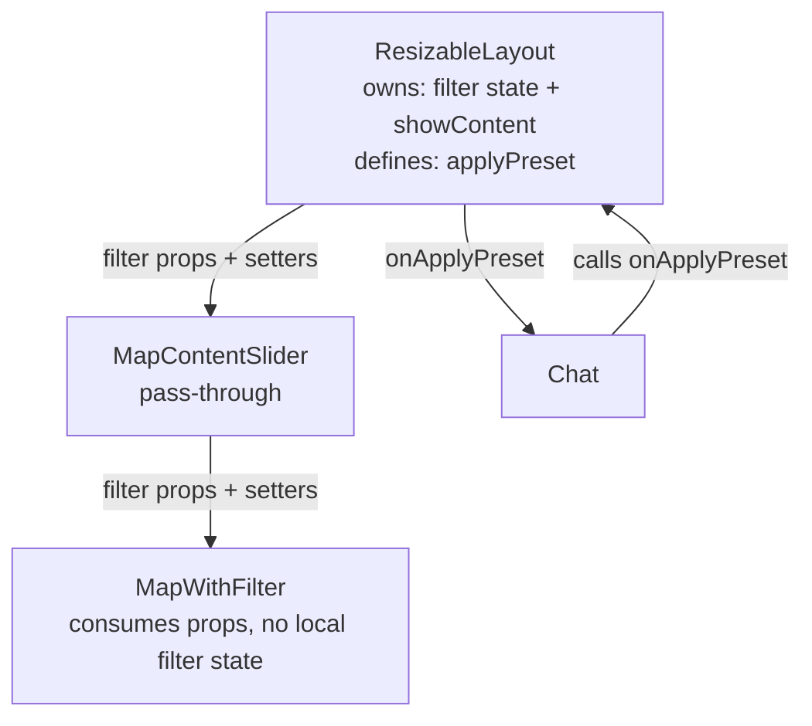
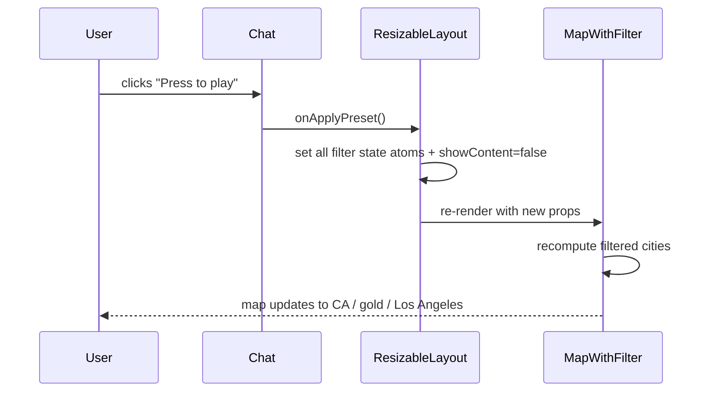

# DES: Chat "Press to Play" Button and Follow-up Questions

## Overview

After each assistant reply in Chat, a "Press to play" button and three static question chips are rendered below the message bubble. Pressing the button overwrites all map filter state with a fixed preset (CA / gold-only / Los Angeles) and navigates to the Map Page. Clicking a chip immediately sends it as a user message.

The core architectural change is **state lifting**: filter state and page-navigation state are moved from `MapWithFilter` / `MapContentSlider` into `ResizableLayout` (the common ancestor of both `Chat` and the map tree), then threaded back down as individual props.

---

## Architecture



---

## State Lifting

### What moves to `ResizableLayout`

All state currently owned by `MapWithFilter` or `MapContentSlider` that Chat needs to influence:

| State | Type | Default |
|---|---|---|
| `selectedState` | `string` | `''` |
| `gameFilter` | `Set<string>` | `new Set(['Olympian', 'Paralympian'])` |
| `seasonFilter` | `Set<string>` | `new Set(['Summer', 'Winter'])` |
| `medalFilter` | `Set<string>` | `new Set(['gold', 'silver', 'bronze', 'noMedal'])` |
| `sportFilter` | `Set<string>` | `new Set()` |
| `selectedAthleteIds` | `Set<number>` | `new Set()` |
| `selectedCityKeys` | `Set<string>` | `new Set()` |
| `showContent` | `boolean` | `false` |

`allAthletes` and `allCities` (computed from `cities`) remain inside `MapWithFilter` — they drive the search dropdowns and are not needed by `ResizableLayout` or `Chat`.

---

## City Filter: `Set<number>` → `Set<string>`

Currently `selectedCityIds` is a `Set<number>` (indices into a local `allCities` array). The preset must set "Los Angeles" without a runtime index lookup. The solution is to change the city filter state to `Set<string>` with `"city|state"` composite keys (e.g. `"Los Angeles|CA"`).

**Impact:**
- `ResizableLayout` holds `selectedCityKeys: Set<string>`.
- `MapWithFilter` receives `selectedCityKeys` and uses it directly for filtering (the existing internal `selectedCityKeys` memo is removed).
- `CitySearch` is updated: `selectedIds → selectedKeys` (type `Set<string>`); `onSelect/onRemove` receive a string key instead of a number.
- `CityEntry` gains a `key` field (`"city|state"`); the numeric `id` field is removed.

`selectedAthleteIds` remains `Set<number>` — athlete lookup is unchanged; the preset always clears it to an empty set.

---

## Preset Constant

Defined in `ResizableLayout` (inline or in a shared constants module):

```ts
const LA_PRESET = {
  selectedState:      'CA',
  gameFilter:         new Set(['Olympian', 'Paralympian']),
  seasonFilter:       new Set(['Summer', 'Winter']),
  medalFilter:        new Set(['gold']),
  sportFilter:        new Set<string>(),
  selectedAthleteIds: new Set<number>(),
  selectedCityKeys:   new Set(['Los Angeles|CA']),
  showContent:        false,
}
```

The `applyPreset` function in `ResizableLayout` sets each state atom from this object:

```ts
function applyPreset() {
  setSelectedState(LA_PRESET.selectedState)
  setGameFilter(LA_PRESET.gameFilter)
  setSeasonFilter(LA_PRESET.seasonFilter)
  setMedalFilter(LA_PRESET.medalFilter)
  setSportFilter(LA_PRESET.sportFilter)
  setSelectedAthleteIds(LA_PRESET.selectedAthleteIds)
  setSelectedCityKeys(LA_PRESET.selectedCityKeys)
  setShowContent(LA_PRESET.showContent)
}
```

---

## Component Contracts

### `ResizableLayout`

**Before:** holds only `chatWidth`. Passes `cities` straight through.  
**After:** also owns all filter state + `showContent`; defines `applyPreset`; passes filter props down and `onApplyPreset` to `Chat`.

```tsx
<MapContentSlider
  cities={cities}
  showContent={showContent}
  onShowContent={setShowContent}
  selectedState={selectedState}
  onStateSelect={setSelectedState}
  gameFilter={gameFilter}
  onGameFilter={setGameFilter}
  seasonFilter={seasonFilter}
  onSeasonFilter={setSeasonFilter}
  medalFilter={medalFilter}
  onMedalFilter={setMedalFilter}
  sportFilter={sportFilter}
  onSportFilter={setSportFilter}
  selectedAthleteIds={selectedAthleteIds}
  onAthleteSelect={...}
  onAthleteRemove={...}
  selectedCityKeys={selectedCityKeys}
  onCitySelect={...}
  onCityRemove={...}
/>
<Chat onApplyPreset={applyPreset} />
```

### `MapContentSlider`

Becomes a pass-through: accepts all filter props + `showContent`/`onShowContent`, forwards them to `MapWithFilter` and manages the slide animation using `showContent`.

The `filteredAthletes` state remains here (it is local to the slider, not needed by `ResizableLayout` or `Chat`).

### `MapWithFilter`

Receives all filter values and setters as props instead of owning them via `useState`. Internal toggle functions (`toggleGame`, `toggleSeason`, etc.) become local helpers that call the prop setters. The internal `selectedCityKeys` memo is removed — `selectedCityKeys` prop is used directly for filtering.

`allAthletes` and `allCities` computation (`useMemo`) stays here, powering the search dropdowns.

### `CitySearch`

```tsx
interface CitySearchProps {
  cities: CityEntry[]          // CityEntry.key = "city|state", no numeric id
  selectedKeys: Set<string>
  onSelect: (key: string) => void
  onRemove: (key: string) => void
  className?: string
}
```

Selected chip rendering: `[...selectedKeys].map(key => { const c = cities.find(c => c.key === key); … })`.  
Dropdown selection: `onSelect(c.key)` instead of `onSelect(c.id)`.

### `Chat`

Receives one new prop: `onApplyPreset: () => void`.

**Assistant message render block** is extended:

```tsx
{/* existing assistant bubble */}
<div className="flex justify-start">
  <div className="max-w-[75%] px-3 py-2 rounded-2xl …">…</div>
</div>

{/* Play button */}
{!msg.typing && (
  <div className="flex flex-col gap-2 mt-2 ml-1">
    <button
      onClick={onApplyPreset}
      className="flex items-center gap-2 px-4 py-1.5 rounded-full bg-[#0B9FEA]
                 hover:bg-[#0a8fd4] text-white text-sm font-medium
                 transition-colors w-fit"
    >
      ▶ Press to play
    </button>

    {FOLLOWUP_QUESTIONS.map(q => (
      <button
        key={q}
        onClick={() => sendText(q)}
        className="text-left text-sm text-[#94A3B8] px-3 py-1.5
                   rounded-lg bg-[#1e293b] border-l-2 border-[#0B9FEA]
                   hover:text-[#e2e8f0] hover:bg-[#253347] transition-colors"
      >
        {q}
      </button>
    ))}
  </div>
)}
```

The `send` function is refactored into `sendText(text: string)` so it can be called by both the input handler and the chip click handler.

**Follow-up question constant** (module-level):

```ts
const FOLLOWUP_QUESTIONS = [
  'Who won gold in LA 1984?',
  'Which sport had the most CA athletes?',
  'Show me Paralympic winners from California',
]
```

Button and chips appear only on non-typing assistant messages (AC-1, AC-2, AC-5 from the requirements).

---

## Data Flow on Preset Press



---

## Files Changed

| File | Change |
|---|---|
| `components/ResizableLayout.tsx` | Add all filter state + `showContent`; define `applyPreset`; pass props to `MapContentSlider` and `Chat` |
| `components/MapContentSlider.tsx` | Remove local filter/navigation state; accept + forward all props |
| `components/MapWithFilter.tsx` | Remove local filter state; accept props; drop `selectedCityKeys` memo; use `selectedCityKeys` prop directly |
| `components/CitySearch.tsx` | Change `selectedIds: Set<number>` → `selectedKeys: Set<string>`; update `CityEntry` type |
| `components/Chat.tsx` | Accept `onApplyPreset` prop; add `sendText` helper; render button + chips after each non-typing assistant message |

---

## UI Details

**"Press to play" button**
- `bg-[#0B9FEA] hover:bg-[#0a8fd4]`, `text-white`, `rounded-full`, `px-4 py-1.5`, `text-sm font-medium`
- Prefix: `▶` character
- `w-fit` — does not stretch full width
- Left-aligned in the assistant column

**Follow-up question chips**
- `bg-[#1e293b]`, `border-l-2 border-[#0B9FEA]`, `rounded-lg`
- Text: `text-[#94A3B8]` default, `hover:text-[#e2e8f0]`
- Full width within the assistant column

**Spacing**
- `mt-2` gap between the assistant bubble and the button
- `gap-2` between button and each chip

---

## Edge Cases

- **Typing bubble**: `msg.typing === true` → button/chips are not rendered (checked via `!msg.typing` guard).
- **System/user messages**: button/chips only render in the `msg.role === 'assistant'` branch.
- **Los Angeles not in dataset**: `selectedCityKeys = new Set(['Los Angeles|CA'])` is applied; if the key matches nothing in the filtered cities, the map renders empty — graceful, no error.
- **Chat unavailable**: `onApplyPreset` still works — filter is independent of chat availability.
