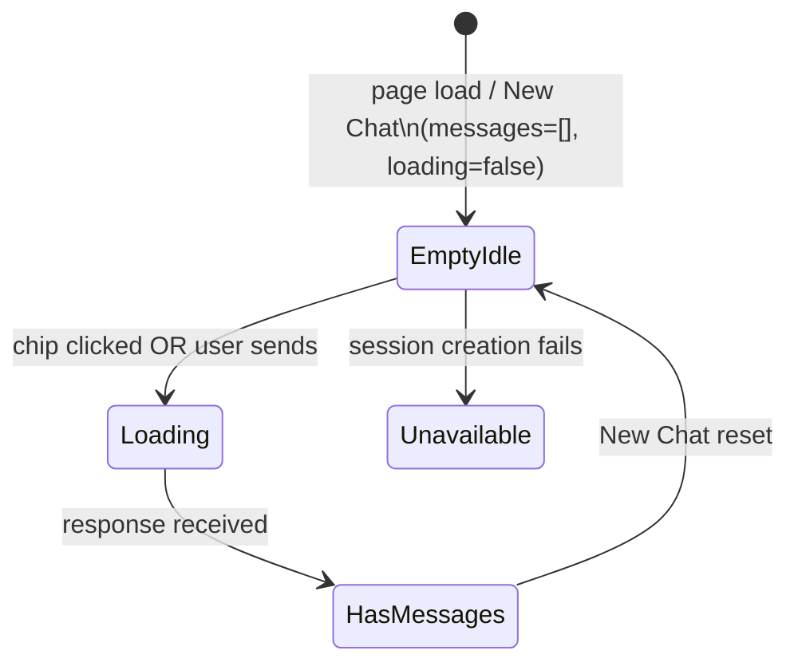

# DES: Chat Suggested Messages

## Overview

A purely front-end change to `components/Chat.tsx`. Three static suggestion chips replace the existing empty-state placeholder text when the chat has no messages, the session is ready, and chat is available. Clicking a chip calls the existing `sendText` helper — no new state, components, or API calls.

---

## Change Scope

| Item | Action |
|------|--------|
| `components/Chat.tsx` | Only file modified |
| New components | None |
| New API endpoints | None |
| New state | None — derived from existing `messages`, `isLoading`, `chatUnavailable` |

---

## Data

A module-level constant above the `Chat` component holds the three fixed strings:

```ts
const SUGGESTED_MESSAGES = [
  'Do we have any athletes from Los Angeles?',
  'Show me athletes from California',
  'Which athlete has secured a greater number of gold medals?',
] as const
```

No prop, no context, no fetch — the list is inlined.

---

## Visibility Logic

```
show chips  ⟺  messages.length === 0
             && !chatUnavailable
             && !isLoading
```

This is evaluated inline in JSX; no derived variable is needed.

- `messages.length === 0` — no conversation yet (or just reset by New Chat)
- `!chatUnavailable` — the unavailable error message owns the empty-state when true
- `!isLoading` — hides chips while the initial session roundtrip is in progress, preventing clicks before `sessionId` exists

---

## Rendering

Replace the current empty-state `<p>` block:

```tsx
// Before
{messages.length === 0 && (
  <p style={{ color: '#868685', fontSize: 14, textAlign: 'center', marginTop: 32 }}>
    {chatUnavailable
      ? 'Chat is unavailable. Please reload the page.'
      : 'Send a message to get started.'}
  </p>
)}
```

With a split that keeps the error text and introduces the chips:

```tsx
// After
{messages.length === 0 && chatUnavailable && (
  <p style={{ color: '#868685', fontSize: 14, textAlign: 'center', marginTop: 32 }}>
    Chat is unavailable. Please reload the page.
  </p>
)}

{messages.length === 0 && !chatUnavailable && !isLoading && (
  <div style={{ display: 'flex', flexDirection: 'column', gap: 8, marginTop: 32 }}>
    {SUGGESTED_MESSAGES.map(text => (
      <button
        key={text}
        onClick={() => sendText(text)}
        style={{
          background: '#e2f6d5',
          color: '#163300',
          border: 'none',
          padding: '7px 12px',
          borderRadius: 9999,
          fontFamily: 'Inter',
          fontSize: 12,
          fontWeight: 600,
          cursor: 'pointer',
          textAlign: 'left',
        }}
      >
        {text}
      </button>
    ))}
  </div>
)}
```

### Styling rationale

Chips use the exact same style values as the existing `followups` pill buttons (`#e2f6d5` / `#163300`, 9999 border-radius, Inter 12 px 600). `textAlign: 'left'` is added because chip text is longer than a typical followup label.

---

## Interaction

```
User clicks chip
  → sendText(chip text)          ← existing function, unchanged
  → message appended to messages ← messages.length becomes > 0
  → chips condition becomes false ← chips disappear
```

No additional onClick wiring; `sendText` already handles `isLoading` guard internally.

---

## Flow Diagram



- **EmptyIdle** — chips visible
- **Loading** — chips hidden (`isLoading=true`)
- **HasMessages** — chips hidden (`messages.length > 0`)
- **Unavailable** — chips hidden, error text shown

---

## Testing Notes

Manual smoke test:
1. Fresh load → chips visible, clicking one sends the message and hides chips.
2. Refresh with saved messages → chips never appear.
3. "New Chat" → chips reappear.
4. Slow network (throttled): chips absent during loading spinner, appear once session is ready.
