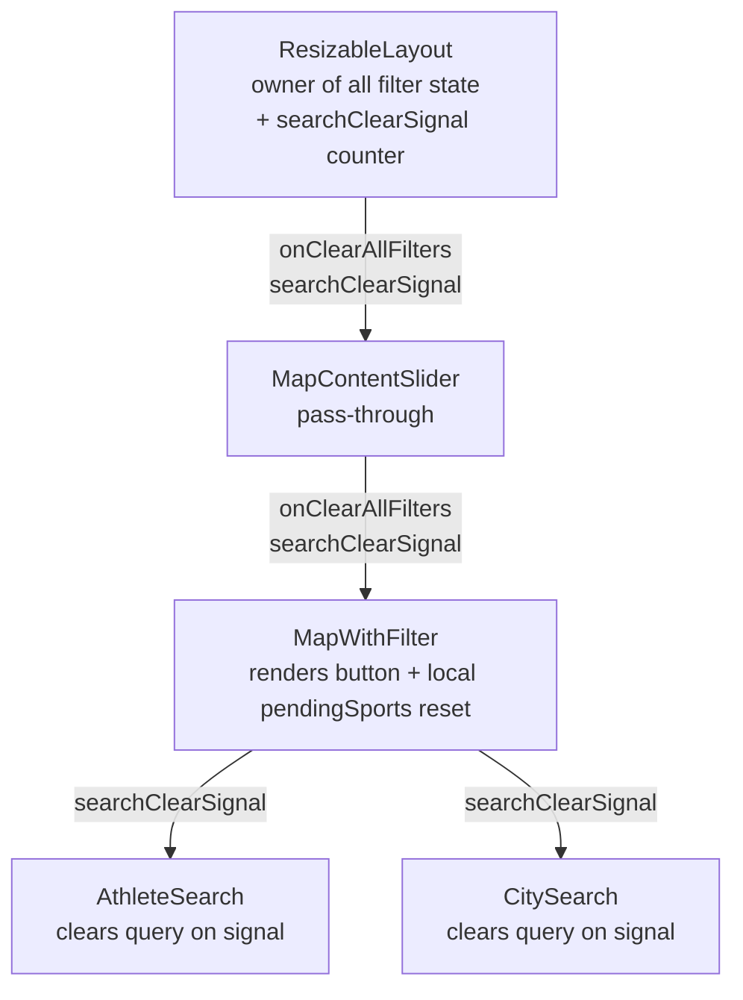

# DES — Clear All Filters Button

## Overview

Add a ghost-text **"Clear All Filters"** button immediately to the right of the Sport filter trigger in the `MapWithFilter` Row 1 toolbar. Clicking it resets all six filter Sets to their initial defaults and clears the typed text + selected tags in both `AthleteSearch` and `CitySearch`.

Requirements: `docs/ddd_requirement/REQ_clear_all_filters_button.md`

---

## Data Flow



---

## File-by-File Changes

### 1. `ResizableLayout.tsx`

**Add state:**
```ts
const [searchClearSignal, setSearchClearSignal] = useState(0)
```

**Add handler:**
```ts
function handleClearAllFilters() {
  setGameFilter(new Set(['Olympian', 'Paralympian']))
  setSeasonFilter(new Set(['Summer', 'Winter']))
  setMedalFilter(new Set(['gold', 'silver', 'bronze', 'noMedal']))
  setSportFilter(new Set<string>())
  setSelectedAthleteIds(new Set<number>())
  setSelectedCityKeys(new Set<string>())
  setSearchClearSignal(prev => prev + 1)
}
```

**Pass down to `MapContentSlider`:**
```tsx
<MapContentSlider
  ...
  onClearAllFilters={handleClearAllFilters}
  searchClearSignal={searchClearSignal}
/>
```

---

### 2. `MapContentSlider.tsx`

**Extend `MapContentSliderProps`:**
```ts
onClearAllFilters: () => void
searchClearSignal: number
```

**Thread through to `MapWithFilter`:**
```tsx
<MapWithFilter
  ...
  onClearAllFilters={onClearAllFilters}
  searchClearSignal={searchClearSignal}
/>
```

---

### 3. `MapWithFilter.tsx`

**Extend props interface:**
```ts
onClearAllFilters: () => void
searchClearSignal: number
```

**Button handler (defined inside the component):**
```ts
function clearAllFilters() {
  setPendingSports(new Set())
  setSportOpen(false)
  onClearAllFilters()
}
```

**Button element** — placed immediately after the `<div ref={dropdownRef}>` Sport block, before the `onContentPage` button:
```tsx
<button
  onClick={clearAllFilters}
  className="text-sm text-[#94a3b8] hover:text-[#e2e8f0] transition-colors"
  style={{ fontFamily: "'Geist', sans-serif" }}
>
  Clear All Filters
</button>
```

**Pass signal to search components:**
```tsx
<AthleteSearch
  ...
  clearSignal={searchClearSignal}
/>
<CitySearch
  ...
  clearSignal={searchClearSignal}
/>
```

---

### 4. `AthleteSearch.tsx`

**Extend `AthleteSearchProps`:**
```ts
clearSignal?: number
```

**Add effect:**
```ts
useEffect(() => {
  setQuery('')
  setIsOpen(false)
}, [clearSignal])
```

---

### 5. `CitySearch.tsx`

**Extend `CitySearchProps`:**
```ts
clearSignal?: number
```

**Add effect:**
```ts
useEffect(() => {
  setQuery('')
  setIsOpen(false)
}, [clearSignal])
```

---

## Design Decisions

| Decision | Choice | Rationale |
|---|---|---|
| Button position | Right of Sport trigger | Left-to-right: filters first, clear action last |
| Button style | Ghost text, `text-[#94a3b8]` | Matches the filter bar's low-chrome dark slate theme; doesn't compete visually with Sport trigger |
| Search text clearing | `clearSignal` counter prop | Least invasive — no `forwardRef`/`useImperativeHandle` boilerplate; components remain functional |
| `pendingSports` reset | Inline in `clearAllFilters()` in `MapWithFilter` | `pendingSports` is local to `MapWithFilter`; reset belongs there |
| Sport panel on clear | Force-close (`setSportOpen(false)`) | Avoids showing the open panel with a stale pending selection while reset is in progress |
| `selectedState` reset | Not included | Requirements only target the six filter Sets + search inputs; `selectedState` is a map interaction, not a filter |

---

## Testing Notes

Manual verification checklist:
1. Set every filter to a non-default value and both searches to non-empty, then click "Clear All Filters" — all reset instantly.
2. Click with no filters active — no error, button is a visible no-op.
3. Open the Sport panel, tick some disciplines, click "Clear All Filters" — panel closes, reopening shows empty selection.
