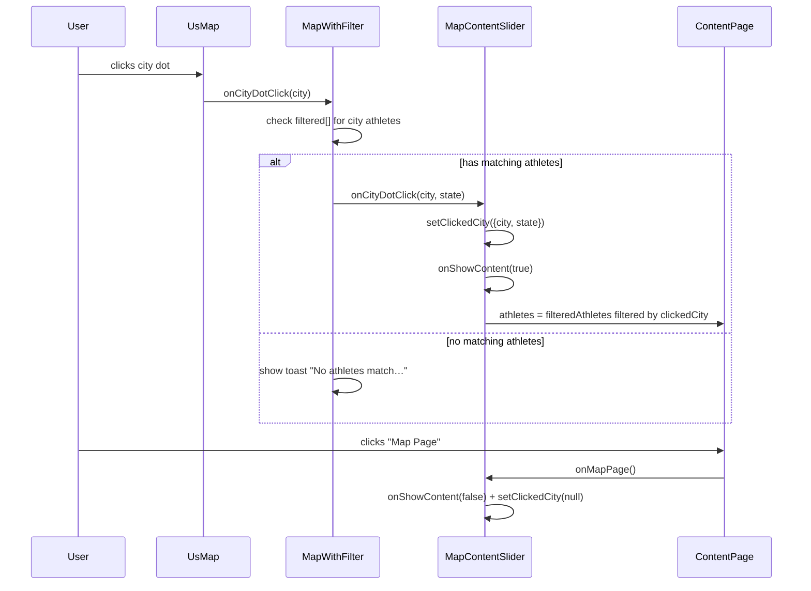

# DES: Dot Click Navigates to Content Page

**Requirements:** `docs/ddd_requirement/REQ_dot_click_to_content_page.md`

---

## Overview

Clicking a blue city dot on the US map slides to `ContentPage` and shows only athletes from that city who also match the currently active filters. If no athletes match, a transient toast banner is shown instead. Pressing "Map Page" restores the map to its exact prior state.

The change is contained entirely within the existing client component tree — no new routes, no API calls, no global state library.

---

## Data Flow



---

## Component Changes

### 1. `UsMap` — add `onCityDotClick` prop

**New prop:**
```ts
onCityDotClick?: (city: City) => void
```

Wire into the D3 city dot `click` event (where the dot `onClick` is currently absent):
```ts
.on('click', (_event: MouseEvent, d: City) => {
  onCityDotClick?.(d)
})
```

No visual change to the dot on click (requirement AC5, AC6).

---

### 2. `MapWithFilter` — intercept dot click, gate on filtered athletes

**New prop:**
```ts
onCityDotClick?: (city: string, state: string) => void
```

**New local state:**
```ts
const [notification, setNotification] = useState<string | null>(null)
const notifTimerRef = useRef<ReturnType<typeof setTimeout> | null>(null)
```

**Internal handler** (passed to `UsMap.onCityDotClick`):
```ts
function handleCityDotClick(city: City) {
  const match = filtered.find(c => c.city === city.city && c.state === city.state)
  if (!match || match.athletes.length === 0) {
    if (notifTimerRef.current) clearTimeout(notifTimerRef.current)
    setNotification(`No athletes from ${city.city} match the current filters.`)
    notifTimerRef.current = setTimeout(() => setNotification(null), 2500)
    return
  }
  onCityDotClick?.(city.city, city.state)
}
```

**Toast notification** — rendered inside the `MapWithFilter` container, absolutely positioned at the top of the map area (below the filter bar, above the SVG):
```tsx
{notification && (
  <div className="absolute top-[96px] left-1/2 -translate-x-1/2 z-50
                  bg-[#1e293b] border border-[#334155] text-[#e2e8f0]
                  text-sm px-4 py-2 rounded-full shadow-lg pointer-events-none">
    {notification}
  </div>
)}
```

The `top` offset clears the filter bar + search row (≈96px). `pointer-events-none` prevents it from blocking map interaction.

---

### 3. `MapContentSlider` — own `clickedCity`, derive city-scoped athletes

**New local state:**
```ts
const [clickedCity, setClickedCity] = useState<{ city: string; state: string } | null>(null)
```

**New handler** (passed to `MapWithFilter`):
```ts
function handleCityDotClick(city: string, state: string) {
  setClickedCity({ city, state })
  onShowContent(true)
}
```

**Derived athletes for `ContentPage`:**
```ts
const contentAthletes = clickedCity
  ? filteredAthletes.filter(a => a.city === clickedCity.city && a.state === clickedCity.state)
  : filteredAthletes
```

**Updated `onMapPage` handler** — clears `clickedCity` when returning to the map:
```tsx
<ContentPage
  athletes={showContent ? contentAthletes : []}
  onMapPage={() => { onShowContent(false); setClickedCity(null) }}
/>
```

The "Content Page >>" button path (`onContentPage`) does **not** set `clickedCity`, so it continues showing the full filtered athlete list unchanged.

---

## State Invariants

| State | Owner | Cleared when |
|-------|-------|-------------|
| `clickedCity` | `MapContentSlider` | "Map Page" pressed |
| `showContent` | `ResizableLayout` | "Map Page" pressed (via `onShowContent(false)`) |
| `notification` | `MapWithFilter` | auto-cleared after 2500 ms |

Returning to the map clears `clickedCity` but leaves all filter state (`selectedState`, `gameFilter`, `seasonFilter`, `medalFilter`, `sportFilter`, `selectedCityKeys`, `selectedAthleteIds`) untouched — this satisfies the "map identical to before click" requirement.

---

## Props Changes Summary

| Component | Added prop | Type | Direction |
|-----------|------------|------|-----------|
| `UsMap` | `onCityDotClick` | `(city: City) => void` | parent → child |
| `MapWithFilter` | `onCityDotClick` | `(city: string, state: string) => void` | parent → child |
| `MapContentSlider` | *(none — internal handler only)* | — | — |

`MapContentSlider`, `ResizableLayout`, and `ContentPage` require **no new props**.

---

## Testing Notes

- Clicking a dot whose city has athletes → slides to Content Page, list scoped to that city.
- Clicking a dot with athletes that are all filtered out → toast appears, no navigation.
- Pressing "Map Page" → map is visually and state-wise identical to pre-click.
- "Content Page >>" button still shows the full filtered athlete list (not city-scoped).
