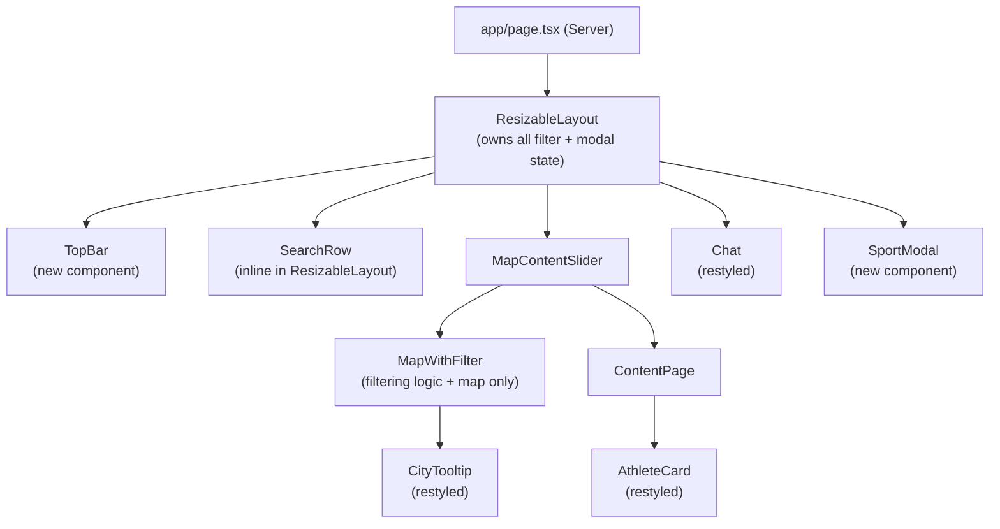

# DES: Heritage UI Redesign

**Date:** 2026-05-11  
**Req:** `docs/ddd_requirement/REQ_heritage_redesign.md`  
**Status:** Locked  

---

## Summary

Replace the dark slate theme with the Heritage light system. The top bar and search row are extracted from `MapWithFilter` and moved to `ResizableLayout` so they span the full viewport width above both the map card and the chat panel. The sport filter becomes a full-screen modal. `lucide-react` is added for icons. All existing filter state, chat AI logic, and data flow are preserved.

---

## Architecture



---

## Design Decisions

### 1. Top bar lifted to ResizableLayout

`ResizableLayout` already owns all filter state (`gameFilter`, `seasonFilter`, `medalFilter`, `sportFilter`, `selectedAthleteIds`, `selectedCityKeys`). Lifting the top bar there requires also lifting two `useMemo` computations currently in `MapWithFilter`:

- `allAthletes` — flat list of all athletes for AthleteSearch
- `allCities` — deduplicated city list for CitySearch

These are moved to `ResizableLayout` (it already receives `cities` prop from the page) and passed into `TopBar`/`SearchRow` and `MapWithFilter`.

**Rationale:** ResizableLayout is already the filter state owner; lifting the UI (not just state) there makes the data flow coherent.

### 2. lucide-react for icons

`lucide-react` replaces the existing PNG images for filter icons, and provides icons for the chat panel and UI chrome (sparkles, mic, arrow-right, chevron, etc.).

**Rationale:** lucide-react is needed for chat panel icons regardless; using it for filter icons too achieves a consistent icon system and matches the Heritage design exactly.

### 3. Sport filter → full-screen modal

`sportOpen` (bool) and `pendingSports` (Set\<string\>) state move from `MapWithFilter` to `ResizableLayout`. `SportModal` renders as `position: fixed, inset: 0` directly inside `ResizableLayout`, so it overlays the whole viewport regardless of layout.

**Rationale:** A fixed overlay must live high enough in the tree to cover the full viewport; ResizableLayout is the right host.

### 4. Chat panel always visible

Chat stays in the right column on both the Map and Content pages (user chose this). `MapContentSlider` still handles the slide transition for map ↔ content. The chat panel width (200–700px, drag to resize) is unchanged.

### 5. Notification toast

The "No athletes from X match filters" toast is moved to `ResizableLayout` (currently in `MapWithFilter`), since the notification should overlay the full layout.

---

## Component Changes

### New files

#### `components/TopBar.tsx`

Full-width white top bar with:
- Logo: black circle (28px) + green dot overlay + "OlymPick" in Archivo Black 22px
- Vertical separator line
- Filter groups (each: uppercase kicker label + control buttons):
  - **Game**: two 38×38px circle icon buttons (Zap = Olympic, Accessibility = Paralympic)
  - **Season**: two 38×38px circle icon buttons (Sun = Summer, Snowflake = Winter)
  - **Medals**: four 32×32px colored circle pip buttons (gold/silver/bronze/no-medal)
  - **Sport**: pill button "All disciplines ▼" or "{N} sports ▼"
- Right side: "Clear filters" ghost text button + "Content page →" / "← Map page" green pill button

**Props:**
```ts
interface TopBarProps {
  showContent: boolean
  onToggleContent: () => void
  gameFilter: Set<string>
  onGameFilter: (s: Set<string>) => void
  seasonFilter: Set<string>
  onSeasonFilter: (s: Set<string>) => void
  medalFilter: Set<string>
  onMedalFilter: (s: Set<string>) => void
  sportFilter: Set<string>
  onOpenSportModal: () => void
  onClearAll: () => void
}
```

Active state for circle buttons:
- Active: background `#e2f6d5`, border `1.5px solid #163300`, icon color `#163300`
- Inactive: background `#ffffff`, border `1px solid rgba(14,15,12,0.10)`, icon color `#454745`

Medal pip active: border `2px solid #163300`  
Medal pip inactive: border `1px solid rgba(14,15,12,0.10)`

#### `components/SportModal.tsx`

Full-screen overlay with 880px centered card.

**Props:**
```ts
interface SportModalProps {
  open: boolean
  pendingSports: Set<string>
  onToggle: (sport: string) => void
  onApply: () => void
  onCancel: () => void
  onClearAll: () => void
}
```

Internal layout:
- Fixed overlay `inset: 0, background: rgba(14,15,12,0.40)`
- White card, `width: 880px, maxHeight: 85vh, borderRadius: 30px`
- Header: "Pick your sports." (Archivo Black 28px) + count subtitle + close × button
- Scroll area:
  - Two search inputs (Athlete + City — visual only, no functional wiring required)
  - SUMMER section with sun icon, amber color header, 3-column checkbox list
  - WINTER section with snowflake icon, blue color header, 3-column checkbox list
- Footer: "Clear all" + "Cancel" + "Apply {N} filters" green pill

Sport lists are the same `SUMMER_SPORTS` / `WINTER_SPORTS` constants already in `MapWithFilter.tsx` — move them to a shared constant file or keep them in MapWithFilter and import.

Checkbox style:
- Checked: background `#9fe870`, border `1.5px solid #163300`, checkmark via `Check` Lucide icon (dark green)
- Unchecked: background `#ffffff`, border `1.5px solid #868685`

Clicking the backdrop (`onCancel`) closes without applying.

---

### Modified files

#### `app/layout.tsx`

Add Google Fonts link for Archivo Black in `<head>`:
```html
<link rel="preconnect" href="https://fonts.googleapis.com" />
<link rel="preconnect" href="https://fonts.gstatic.com" crossOrigin="" />
<link href="https://fonts.googleapis.com/css2?family=Archivo+Black&family=Inter:wght@400;500;600;700;800;900&display=swap" rel="stylesheet" />
```

#### `app/globals.css`

Replace the dark-theme base styles with Heritage tokens. Set `background: #fafaf7` on `html, body`. Retain any Tailwind directives.

Key CSS variables to add (matches `tokens.css` from design):
```css
:root {
  --bg-canvas: #fafaf7;
  --bg-surface: #ffffff;
  --fg-1: #0e0f0c;
  --fg-2: #454745;
  --fg-3: #868685;
  --accent-green: #9fe870;
  --dark-green: #163300;
  --mint: #e2f6d5;
  --border-subtle: rgba(14,15,12,0.10);
  --shadow-ring: rgba(14,15,12,0.12) 0 0 0 1px;
  --font-display: 'Archivo Black', system-ui, sans-serif;
  --font-body: 'Inter', system-ui, sans-serif;
}
```

#### `components/ResizableLayout.tsx`

**Changes:**
1. Background changes from dark gradient to `#fafaf7`
2. Add `allAthletes` and `allCities` useMemo computations (lifted from MapWithFilter)
3. Add `sportOpen` (bool) + `pendingSports` (Set\<string\>) state
4. Add `openSportModal()` / `closeSportModal()` / `applyAndClose()` helpers
5. Render `<TopBar>` and a search row above the flex-row body
6. Render `<SportModal>` conditionally
7. Pass `onCityDotClick` flow through (already exists)
8. Chat panel outer div: change to white card with 30px radius and 24px margin

Search row inline JSX (no new component needed — it's small):
```tsx
<div style={{ background: '#fff', borderBottom: '1px solid rgba(14,15,12,0.10)', padding: '14px 32px', display: 'flex', gap: 16 }}>
  <AthleteSearch ... />
  <CitySearch ... />
</div>
```

Drag separator: keep existing logic; restyle bar from `#334155` to `rgba(14,15,12,0.10)`, dots from `#475569` to `rgba(14,15,12,0.20)`.

Chat panel wrapper change:
```tsx
// Before: plain div with width style
// After: white card with margin and radius
<div style={{ width: chatWidth, flexShrink: 0, height: '100%', padding: '24px 32px 24px 0' }}>
  <Chat onApplyFilters={applyAgentFilters} />
</div>
```

Chat itself gets the rounded card via its own styling (see Chat.tsx below).

#### `components/MapWithFilter.tsx`

**Remove:**
- The entire filter toolbar JSX (Row 1: game/season/medal/sport/clear/content buttons)
- The search row JSX (Row 2: AthleteSearch, CitySearch)
- `allAthletes` and `allCities` useMemo
- `sportOpen`, `pendingSports`, sport modal state
- `dropdownRef`
- `sportLabel` computation
- `openSportPanel`, `closeSportPanel`, `applyAndClose`, `clearAllFilters` handlers
- `onClearAllFilters` prop (no longer called here)
- `onContentPage` prop (moved to TopBar)

**Keep:**
- `filtered` useMemo (the actual filtering logic)
- `onFilteredChange` effect
- `handleCityDotClick` + `notification` toast state
- UsMap rendering

**Add:**
- Pass `notification` toast position changes: now toast is positioned within the map card

**Prop interface changes:**
```ts
// Remove: onContentPage, onClearAllFilters
// Remove: selectedAthleteIds (already via selectedAthleteKeys, can keep for API compat)
// Keep all: cities, selectedState, onStateSelect, gameFilter, seasonFilter, medalFilter,
//           sportFilter, selectedAthleteIds, onAthleteSelect, onAthleteRemove,
//           selectedAthleteNames, selectedCityKeys, onCitySelect, onCityRemove,
//           searchClearSignal, onCityDotClick, onFilteredChange
```

**Visual changes:**
- Container: remove the dark bg/border, just render the white map card directly
- Map card: `background: #fff, borderRadius: 30, border: 1px solid rgba(14,15,12,0.10), padding: 18px, flex: 1`
- State fill color: `#eef2ec`
- Dot color: `#0e0f0c`

#### `components/Chat.tsx`

Visual changes only — no logic changes:

**Container:** `background: #fff, borderRadius: 30, border: 1px solid rgba(14,15,12,0.10), height: 100%, display: flex, flexDirection: column, overflow: hidden`

**Header (replace current):**
```
[Green circle 28px w/ sparkles icon]  [Ask OlymPick | Online · 128 yrs of data]    [+ New pill]
```
- Green circle: `background: #9fe870`; Lucide `Sparkles` icon, dark green
- Title: "Ask OlymPick", Inter 14px, weight 700, `#0e0f0c`
- Subtitle: "Online · 128 yrs of data", Inter 11px, weight 500, `#868685`
- "+ New" button: `background: #e2f6d5, color: #163300, borderRadius: 9999, padding: 7px 12px, fontSize: 11px, fontWeight: 700`; wires to existing `newSession()`

**User message bubble:**
- `background: #0e0f0c, color: #fafaf7, borderRadius: 20px 20px 4px 20px, padding: 10px 16px`

**AI message bubble:**
- `background: #ffffff, color: #0e0f0c, borderRadius: 4px 20px 20px 20px, padding: 12px 16px, boxShadow: rgba(14,15,12,0.10) 0 0 0 1px`

**Follow-up chips:**
- `background: #e2f6d5, color: #163300, borderRadius: 9999, padding: 7px 12px, fontSize: 12px, fontWeight: 600`

**Composer (replace input+send row):**
```
[  input text (flex-1)  ] [🎤 Lucide Mic] [→ Lucide ArrowRight on green circle]
```
- Outer form: `background: #fff, borderRadius: 9999, padding: 6px 6px 6px 18px, boxShadow: rgba(14,15,12,0.12) 0 0 0 1px`
- Input: transparent bg, no border, Inter 14px
- Mic button: transparent bg, Lucide `Mic` 14px, color `#454745`
- Send button: `width: 36, height: 36, borderRadius: 50%, background: #9fe870`; Lucide `ArrowRight` icon, dark green; wires to existing `send()`

**System message:** keep as italic centered text, color `#868685`

**Typing indicator:** keep existing 3-dot bounce animation

#### `components/CityTooltip.tsx`

**Changes (visual only, logic unchanged):**
- Container: `background: #fff, borderRadius: 20, boxShadow: rgba(14,15,12,0.20) 0 0 0 1px + 0 12px 32px rgba(14,15,12,0.10), width: 280, fontFamily: Inter`
- Header row: city name in Archivo Black 22px (`#0e0f0c`) + "HOMETOWN" badge (mint bg, dark-green text, pill)
- Subtitle: "{State} · {N} athletes", `#868685`, 11px, weight 600
- Athlete rows: border between rows; avatar (thumbnail or initials), name 13px weight 700, sport 11px weight 500 (`#454745`), medal chips (pill badges: gold `#FFD166`, silver `#D9DFE4`, bronze `#D78F5E`)
- Avatar fallback: gradient circle using `hsl` from name charCode (matches design prototype)

Medal chip component (inline in CityTooltip):
```tsx
// pill span: background color, text color, padding 2px 7px, borderRadius 9999, fontSize 11px, fontWeight 700
// colors: g → { bg: '#FFD166', text: '#3d2a00' }, s → { bg: '#D9DFE4', text: '#1a2330' }, b → { bg: '#D78F5E', text: '#2a1400' }
```

#### `components/AthleteCard.tsx`

**Changes:**
- Container: `background: #fff, borderRadius: 20, padding: 22px, boxShadow: rgba(14,15,12,0.10) 0 0 0 1px`
- Avatar: 120px wide, 16px radius (rounded rectangle)
  - If thumbnail: `` with `borderRadius: 16`
  - Else: gradient avatar using `hsl` from name charCode, white initials
- Name: Inter 800 19px `#0e0f0c`
- City/state: Inter 13px weight 600 `#454745`
- Sport badge: first sport, mint pill (`#e2f6d5`, `#163300`), uppercase 10px weight 700
- Birth year: parsed from `birthday` field, "Born {year}", `#868685`, 11px
- Medal chips: gold/silver/bronze pill badges (same as CityTooltip)
- Fun fact: `#454745`, 13px, italic (keep existing)
- Biography: keep existing sanitized HTML expand/collapse
- Read more / Show less: `color: #163300`, no border, Inter 12px weight 700

#### `components/ContentPage.tsx`

**Changes (visual only, logic unchanged):**
- Container: `background: #fafaf7` (no longer its own card since the map area is now full-height)
- Remove the header bar with "← Map Page" button (the button is now in TopBar)
- The content page no longer needs its own back button — TopBar handles the Map/Content toggle
- Grid: keep 2-column grid, 16px gap
- Empty state: `color: #868685`, centered

**Note:** `ContentPage` loses its `onMapPage` prop since that button moves to `TopBar`. The prop is removed from `ContentPage` and `MapContentSlider`.

#### `components/MapContentSlider.tsx`

Minor change:
- Remove the `onMapPage` → `ContentPage` prop threading (TopBar now handles it)
- Container: transparent background (page bg shows through)
- Remove `onContentPage` prop (no longer passed to MapWithFilter either)

---

## State Flow After Restructure

```
ResizableLayout
  state: showContent, selectedState, gameFilter, seasonFilter, medalFilter, sportFilter,
         selectedAthleteIds, selectedAthleteNames, selectedCityKeys, searchClearSignal,
         chatWidth, sportOpen, pendingSports              ← NEW: sportOpen, pendingSports
  memo:  allAthletes, allCities                          ← LIFTED from MapWithFilter

  ├─ TopBar            ← receives filter state + handlers + showContent
  ├─ SearchRow (inline) ← AthleteSearch + CitySearch, same props as before
  ├─ MapContentSlider  ← receives filter state (minus onContentPage, minus onClearAllFilters)
  │   ├─ MapWithFilter ← receives filter state; no longer renders filter UI
  │   └─ ContentPage   ← no longer receives onMapPage
  ├─ Chat              ← unchanged interface
  └─ SportModal        ← new, receives sportOpen + pendingSports + handlers
```

---

## Package Changes

```
npm install lucide-react
```

No other dependency changes. `dompurify` (already installed) stays for AthleteCard biography.

---

## File Summary

| File | Change |
|---|---|
| `app/layout.tsx` | Add Archivo Black Google Fonts `<link>` |
| `app/globals.css` | Replace dark base styles with Heritage tokens |
| `components/ResizableLayout.tsx` | Major: lift allAthletes/allCities, add TopBar + SearchRow + SportModal, restyle chat wrapper + separator + background |
| `components/TopBar.tsx` | **NEW**: full-width Heritage top bar |
| `components/SportModal.tsx` | **NEW**: full-screen sport disciplines modal |
| `components/MapWithFilter.tsx` | Remove filter UI, keep filtering logic + map; restyle map card |
| `components/Chat.tsx` | Restyle: white card, Heritage header/bubbles/composer |
| `components/CityTooltip.tsx` | Restyle: Heritage popup spec |
| `components/AthleteCard.tsx` | Restyle: Heritage card spec |
| `components/ContentPage.tsx` | Restyle: remove back button (TopBar owns it), Heritage colors |
| `components/MapContentSlider.tsx` | Remove onContentPage/onMapPage threading |

---

## Testing

- `npm run build` must pass with no TypeScript errors after all changes
- Visual: open the app, verify top bar spans full width, filters toggle correctly, sport modal opens/applies, map card and chat panel are white cards with correct radius, popup shows Heritage spec on dot hover, content page cards render with Heritage style
