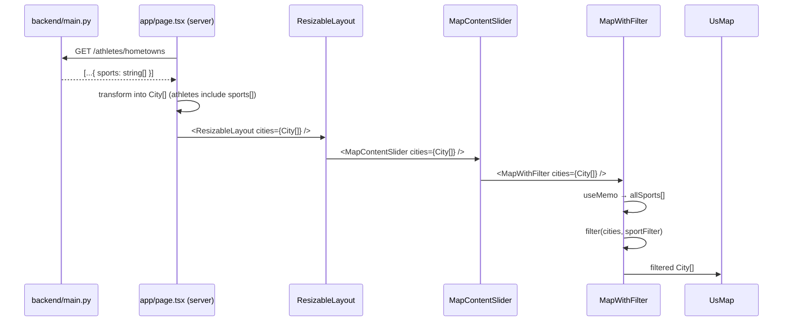

# DES: Sport Discipline Filter

## Overview

This document describes the implementation design for wiring up the Sport dropdown filter on the athlete hometown map. The change spans the backend API and three frontend components. Requirements reference: `docs/ddd_requirement/REQ_sport_discipline_filter.md`.

---

## Data Flow



No new props are needed beyond threading `sports` into the existing `City` shape.

---

## Backend Change — `backend/main.py`

Add a `sports` field to each athlete object returned by `GET /athletes/hometowns`.

```python
"sports": list({s.get("title") for s in a.get("sport", []) if s.get("title")}),
```

- Uses a set comprehension to de-duplicate titles.
- Converted to `list` so it serialises as a JSON array.
- Athletes with no `sport` entries → `[]`.

Full updated athlete dict (additions highlighted):

```python
result.append({
    "first_name": a.get("first_name"),
    "last_name": a.get("last_name"),
    "hometown": hometown,
    "olympic_paralympic": a.get("olympic_paralympic"),
    "seasons": list({s.get("season") for s in a.get("sport", []) if s.get("season")}),
    "medals": a.get("medals", {"gold": 0, "silver": 0, "bronze": 0}),
    "sports": list({s.get("title") for s in a.get("sport", []) if s.get("title")}),  # NEW
})
```

---

## Frontend Type Changes

### Athlete shape (updated in both `MapContentSlider.tsx` and `MapWithFilter.tsx`)

```ts
athletes: {
  first_name: string
  last_name: string
  olympic_paralympic: string
  seasons: string[]
  medals: { gold: number; silver: number; bronze: number }
  sports: string[]   // NEW
}[]
```

Both files define the `City` interface independently; both are updated in-place (no shared type file introduced).

### `app/page.tsx` transform

Add `sports` to each athlete entry in the `cityMap` transform:

```ts
cityMap.get(key)!.athletes.push({
  first_name: a.first_name,
  last_name: a.last_name,
  olympic_paralympic: a.olympic_paralympic ?? '',
  seasons: a.seasons ?? [],
  medals: a.medals ?? { gold: 0, silver: 0, bronze: 0 },
  sports: a.sports ?? [],   // NEW
})
```

---

## MapWithFilter — State and Logic

### New state

```ts
const [sportFilter, setSportFilter] = useState('')       // '' = All Disciplines
const [sportOpen, setSportOpen] = useState(false)        // dropdown open/close
```

### Available disciplines list

```ts
const allSports = useMemo(() =>
  [...new Set(cities.flatMap(c => c.athletes.flatMap(a => a.sports)))].sort()
, [cities])
```

Computed once on mount (cities never changes after initial render).

### Filter chain addition

The sport filter is appended to the existing athlete predicate inside the `.map()`:

```ts
const sportMatch = sportFilter === '' || a.sports.includes(sportFilter)
return gameMatch && seasonMatch && medalMatch && sportMatch
```

### Outside-click handling

A `useEffect` attaches a `mousedown` listener to `document` while the dropdown is open:

```ts
useEffect(() => {
  if (!sportOpen) return
  const handler = (e: MouseEvent) => {
    if (!dropdownRef.current?.contains(e.target as Node)) setSportOpen(false)
  }
  document.addEventListener('mousedown', handler)
  return () => document.removeEventListener('mousedown', handler)
}, [sportOpen])
```

`dropdownRef` is a `useRef<HTMLDivElement>(null)` attached to the pill's wrapper `div`.

---

## Dropdown Component Structure

The existing Sport pill `div` is replaced with the following structure (all within `MapWithFilter`; no new component file):

```
<div ref={dropdownRef} className="relative flex items-center gap-2">
  │
  ├── <span> "Sport" label
  │
  └── <div onClick={toggle}> pill trigger
        ├── <span> selected label ("All Disciplines" | sportFilter)
        └── <span> "▾" chevron
      <div> dropdown list  ← absolute, z-50, shown when sportOpen
        ├── <button> "All Disciplines"
        ├── <button> "Alpine Skiing"
        ├── <button> "Archery"
        └── ...
```

### Pill trigger styles (matching design spec)

| Property        | Value                               |
|-----------------|-------------------------------------|
| Background      | `bg-[#1A1A1A]`                      |
| Corner radius   | `rounded`                           |
| Padding         | `px-2 py-1.5` (≈ 6px v, 8px h)    |
| Height          | `h-[30px]` + `items-center`        |
| Label text      | `text-[#f1f5f9] text-sm`            |
| Chevron         | `text-[#71717A] text-xs`            |

### Dropdown list styles

| Property        | Value                               |
|-----------------|-------------------------------------|
| Position        | `absolute top-full mt-1 left-0`    |
| Background      | `bg-[#1A1A1A]`                      |
| Corner radius   | `rounded`                           |
| Border          | `border border-[#334155]`           |
| Z-index         | `z-50`                              |
| Max height      | `max-h-60 overflow-y-auto`          |
| Item text       | `text-[#f1f5f9] text-sm`            |
| Item padding    | `px-3 py-1.5`                       |
| Hover           | `hover:bg-[#334155]`                |
| Selected item   | `text-[#06B6D4]` (cyan accent)      |

---

## Key Rationale

| Decision | Rationale |
|---|---|
| Custom div dropdown | Matches `Component/SportDisciplinesFilter` design exactly; consistent with the existing filter bar's hand-styled controls. |
| `useMemo` in `MapWithFilter` | Co-located with filter logic; avoids a second prop chain. `cities` is effectively static so memo overhead is negligible. |
| Both type files updated in-place | Matches the existing codebase pattern; extracting shared types is out of scope per requirements. |
| `sports` as `string[]` on athlete | Flat array of unique titles is the simplest shape for `includes()` matching and `flatMap` derivation. |

---

## Testing

- `npm run build` must pass (TypeScript strict mode validates the new `sports` field end-to-end).
- Manual smoke test: select a discipline, confirm only matching city dots remain; re-select "All Disciplines", confirm all dots return.
