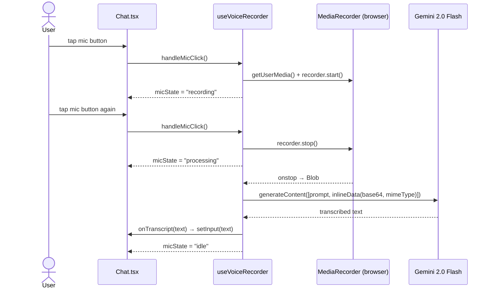
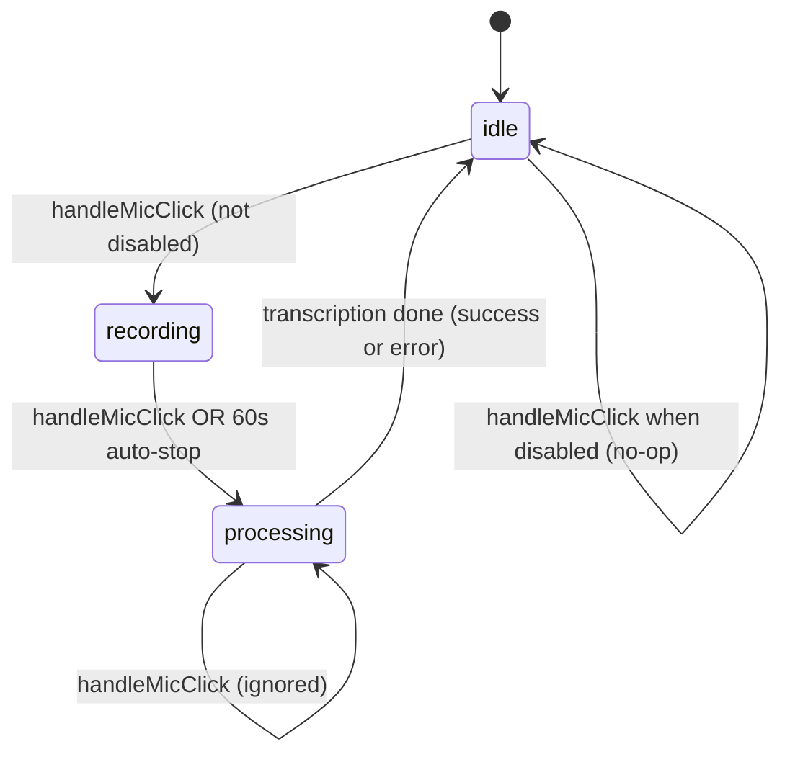

# DES: Voice Chat via Gemini Speech-to-Text

## Overview

Wire up the existing inert mic button in `Chat.tsx` to record audio via the browser MediaRecorder API, transcribe it using the Gemini 2.0 Flash multimodal API, and populate the chat text input. All voice logic lives in a dedicated `useVoiceRecorder` hook; `Chat.tsx` consumes state and a single handler. The OlymPick `/agent/chat` backend is unchanged.

---

## Architecture

```
Chat.tsx (consumer)
  │  uses
  ▼
hooks/useVoiceRecorder.ts
  ├── Browser MediaRecorder API   ← captures audio
  ├── @google/generative-ai SDK   ← transcription
  └── Returns { micState, error, handleMicClick }
```

### Data flow sequence



---

## Mic State Machine



---

## New File: `hooks/useVoiceRecorder.ts`

### Interface

```typescript
type MicState = 'idle' | 'recording' | 'processing'

function useVoiceRecorder(options: {
  onTranscript: (text: string) => void
  disabled: boolean
}): {
  micState: MicState
  error: string | null
  handleMicClick: () => void
}
```

### Implementation sketch

```typescript
'use client'
import { useRef, useState, useEffect } from 'react'
import { GoogleGenerativeAI } from '@google/generative-ai'

const GEMINI_KEY = process.env.NEXT_PUBLIC_GEMINI_API_KEY ?? ''
const MAX_MS = 60_000

export function useVoiceRecorder({ onTranscript, disabled }) {
  const [micState, setMicState] = useState<MicState>('idle')
  const [error, setError] = useState<string | null>(null)
  const recorderRef  = useRef<MediaRecorder | null>(null)
  const chunksRef    = useRef<Blob[]>([])
  const autoStopRef  = useRef<ReturnType<typeof setTimeout> | null>(null)
  const errorTimerRef = useRef<ReturnType<typeof setTimeout> | null>(null)

  function showError(msg: string) {
    setError(msg)
    clearTimeout(errorTimerRef.current!)
    errorTimerRef.current = setTimeout(() => setError(null), 3_000)
  }

  async function transcribe(blob: Blob) {
    setMicState('processing')
    try {
      const ab     = await blob.arrayBuffer()
      const base64 = btoa(String.fromCharCode(...new Uint8Array(ab)))
      const model  = new GoogleGenerativeAI(GEMINI_KEY)
                         .getGenerativeModel({ model: 'gemini-2.0-flash' })
      const result = await model.generateContent([
        'Transcribe the following audio accurately. Return only the transcribed text, nothing else.',
        { inlineData: { data: base64, mimeType: blob.type || 'audio/webm' } },
      ])
      const text = result.response.text().trim()
      if (text) onTranscript(text)
    } catch {
      showError('Transcription failed. Please try again.')
    } finally {
      setMicState('idle')
    }
  }

  async function startRecording() {
    try {
      const stream   = await navigator.mediaDevices.getUserMedia({ audio: true })
      const recorder = new MediaRecorder(stream)
      chunksRef.current = []
      recorder.ondataavailable = e => { if (e.data.size > 0) chunksRef.current.push(e.data) }
      recorder.onstop = () => {
        stream.getTracks().forEach(t => t.stop())
        transcribe(new Blob(chunksRef.current, { type: recorder.mimeType }))
      }
      recorder.start()
      recorderRef.current = recorder
      setMicState('recording')
      autoStopRef.current = setTimeout(stopRecording, MAX_MS)
    } catch {
      showError('Microphone access denied.')
    }
  }

  function stopRecording() {
    clearTimeout(autoStopRef.current!)
    recorderRef.current?.stop()
    recorderRef.current = null
  }

  function handleMicClick() {
    if (disabled || micState === 'processing') return
    if (micState === 'idle') startRecording()
    else stopRecording()
  }

  useEffect(() => () => {
    clearTimeout(autoStopRef.current!)
    clearTimeout(errorTimerRef.current!)
    recorderRef.current?.stop()
  }, [])

  return { micState, error, handleMicClick }
}
```

---

## Changes to `components/Chat.tsx`

### 1. Consume the hook

```typescript
const { micState, error: voiceError, handleMicClick } = useVoiceRecorder({
  onTranscript: text => setInput(text),
  disabled: isLoading || chatUnavailable,
})
```

### 2. Mic button — visual states

| `micState` | Icon color | Animation | `aria-label` | `disabled` |
|------------|------------|-----------|--------------|------------|
| `idle` | `#454745` (gray) | none | `"Start recording"` | only if `isLoading \|\| chatUnavailable` |
| `recording` | `#ef4444` (red) | CSS pulse | `"Stop recording"` | no |
| `processing` | `#454745` (gray) | CSS spin or opacity flicker | `"Processing..."` | yes |

Replace the current static mic button with:

```tsx
<button
  type="button"
  onClick={handleMicClick}
  disabled={micState === 'processing' || isLoading || chatUnavailable}
  aria-label={
    micState === 'recording' ? 'Stop recording' :
    micState === 'processing' ? 'Processing...' :
    'Start recording'
  }
  style={{
    width: 34, height: 34, borderRadius: '50%',
    border: 'none', background: 'transparent',
    cursor: micState === 'processing' ? 'default' : 'pointer',
    display: 'flex', alignItems: 'center', justifyContent: 'center',
    animation: micState === 'recording' ? 'pulse 1s infinite' : 'none',
  }}
>
  <Mic
    size={14}
    color={micState === 'recording' ? '#ef4444' : '#454745'}
  />
</button>
```

The `pulse` keyframe is already used in the chat for the typing indicator — reuse the same `@keyframes bounce` pattern or add a dedicated `pulse` keyframe in `globals.css`.

### 3. Error message — below the `<form>`

```tsx
{voiceError && (
  <p style={{
    color: '#ef4444',
    fontSize: 12,
    marginTop: 6,
    paddingLeft: 4,
    fontFamily: 'Inter',
  }}>
    {voiceError}
  </p>
)}
```

---

## Dependency

```bash
npm install @google/generative-ai
```

---

## Environment variable

Add to `.env.local`:

```
NEXT_PUBLIC_GEMINI_API_KEY=your_key_here
```

---

## Key Design Decisions & Rationale

| Decision | Choice | Reason |
|----------|--------|--------|
| Gemini client | `@google/generative-ai` SDK | Typed API; handles blob/base64 pattern cleanly |
| Model | `gemini-2.0-flash` | Latest fast model; native audio support |
| Code location | `useVoiceRecorder` hook | Keeps Chat.tsx readable; logic is self-contained and independently testable |
| Recording cap | 60 seconds | Prevents large blobs and cost spikes; sufficient for chat queries |
| Error dismiss | 3 seconds auto-dismiss | Non-blocking; short messages are readable in 3s |
| Audio format | MediaRecorder default (`audio/webm` in Chrome, `audio/ogg` in Firefox) | No conversion needed; Gemini accepts both |
| Transcription prompt | Explicit "return only transcribed text" | Prevents Gemini from adding commentary or formatting |

---

## Testing

Manual test cases (no automated tests added):
- Grant mic permission → speak → stop → verify text in input
- Deny mic permission → verify "Microphone access denied." error appears and auto-dismisses
- Speak for 60+ seconds → verify auto-stop fires and transcription proceeds
- Invalid API key → verify "Transcription failed" error
- Chat in `isLoading` state → verify mic button is disabled
